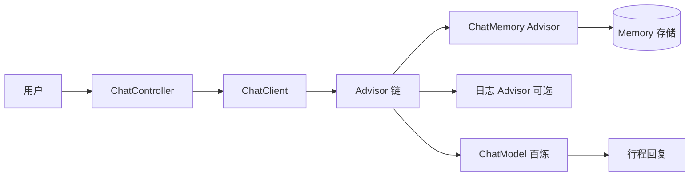

# 学习笔记 · 第 03 天：Prompt 工程与多轮对话应用

> 课程原型：**AI 恋爱大师** → 本项目适配：**AI 旅行规划助手**  
> 前置章节：[第 02 章 · AI 大模型接入](./学习笔记-02-AI大模型接入.md)  
> 深度思考：[深度思考练习手册](./深度思考练习手册.md)  
> 项目仓库：`ai-travel-planner`（`com.yupi:yu-ai-agent`）

---

## 本章目标

1. 掌握 Prompt 工程基础与优化技巧，能为旅行场景写出可用提示词
2. 完成 **AI 旅行规划助手** 的需求分析与方案设计
3. 使用 Spring AI 的 **ChatClient、Advisor、ChatMemory** 实现多轮对话
4. 了解结构化输出（行程报告）、记忆持久化、PromptTemplate、多模态扩展

**友情提示**：AI 技术迭代快，教程细节可能过时；重点学 **思路和方法**，养成查 [Spring AI 官方文档](https://docs.spring.io/spring-ai/reference/) 的习惯。

---

## 一、Prompt 工程

### 1.1 基本概念

**Prompt（提示词）** 是发给大模型的输入，包含指令、上下文、示例和输出要求。模型质量固定时，**Prompt 质量直接决定回答质量**。

对旅行规划项目而言，Prompt 要解决：

- 理解用户意图（去哪、几天、预算、偏好）
- 约束输出格式（分天行程、Markdown、JSON）
- 减少胡编（后续结合 RAG）

### 1.2 提示词分类

#### 核心：基于角色的分类


| 角色消息          | 作用            | 旅行项目示例       |
| ------------- | ------------- | ------------ |
| **System**    | 定义 AI 身份与全局规则 | 「你是专业旅行规划师…」 |
| **User**      | 用户本轮输入        | 「我想去杭州玩 3 天」 |
| **Assistant** | 模型历史回复        | 上一轮生成的行程摘要   |


```text
System：你是谁、能做什么、不能做什么
User：用户当前问题
Assistant：多轮对话中的历史回答
```

#### 扩展：基于功能的分类


| 类型    | 说明       | 旅行场景              |
| ----- | -------- | ----------------- |
| 任务型   | 完成明确任务   | 「生成 3 天杭州行程」      |
| 对话型   | 多轮澄清需求   | 「预算多少？喜欢美食还是风景？」  |
| 检索增强型 | 结合外部知识   | 「根据攻略文档推荐景点」（RAG） |
| 工具型   | 触发函数/MCP | 「查明天杭州天气」         |


#### 扩展：基于复杂度的分类


| 级别  | 特点           | 例子                           |
| --- | ------------ | ---------------------------- |
| 简单  | 一句话指令        | 「推荐杭州景点」                     |
| 中等  | 角色 + 约束      | System + 输出格式要求              |
| 复杂  | 示例 + 步骤 + 格式 | Few-shot + CoT + JSON Schema |


### 1.3 Token

**Token** 是大模型计费与上下文窗口的基本单位（不是「一个字」）。


| 主题   | 要点                                                 |
| ---- | -------------------------------------------------- |
| 如何计算 | 中英文、标点切分方式不同；可用百炼控制台或 `jtokkit`（项目已依赖）估算           |
| 成本计算 | `费用 ≈ 输入 token 单价 × 输入量 + 输出 token 单价 × 输出量`       |
| 优化技巧 | 压缩 System Prompt、摘要历史对话、RAG 只检索相关片段、控制 `maxTokens` |


**旅行项目注意**：行程越长输出 token 越多，报告功能要限制天数或要求「精简版 / 详细版」两种模式。

---

## 二、Prompt 优化技巧

### 2.1 利用资源

1. **Prompt 学习**：OpenAI / 百炼 Prompt 指南、编程导航教程
2. **提示词库**：[PromptSource](https://github.com/xxx)、社区精选（旅行类可搜「travel itinerary prompt」）

### 2.2 基础提示技巧


| 技巧          | 做法                 | 旅行项目示例                                                |
| ----------- | ------------------ | ----------------------------------------------------- |
| **明确任务和角色** | System 写清身份与边界     | 「你是 AI 旅行规划师，只回答与旅行相关的问题」                             |
| **详细说明与示例** | 给 1～2 个输入输出样例      | 示例：输入「北京 3 天」→ 输出分天 Markdown                          |
| **结构化格式引导** | 用标题、编号、步骤          | 「按 Day1/Day2/Day3 输出，每天含：上午/下午/晚上」                    |
| **明确输出格式**  | 指定 Markdown / JSON | 「必须输出 JSON，字段：destination, days, budget, itinerary[]」 |


**本项目 System Prompt 草案（可放进后续 `ChatClient`）：**

```text
你是「AI 旅行规划助手」，帮用户制定可执行的旅行方案。

规则：
1. 信息不足时，先追问：目的地、天数、预算、人数、偏好（美食/自然/人文/亲子等）
2. 信息足够后，输出分天行程，每天包含：交通、景点、餐饮、住宿建议、预估花费
3. 语气友好、务实，避免空泛形容词
4. 不确定的信息标注「建议出发前核实」
5. 只回答旅行相关问题，其他话题礼貌拒绝
```

### 2.3 进阶提示技巧


| 技巧               | 说明                  | 旅行场景                    |
| ---------------- | ------------------- | ----------------------- |
| **思维链 CoT**      | 「请一步步分析再给出行程」       | 先列约束（预算/天数），再排景点顺序      |
| **少样本 Few-shot** | Prompt 内带 1～2 个完整样例 | 给一个「杭州 3 天」标准输出作模板      |
| **分步骤**          | 拆成收集信息 → 排程 → 估预算   | 多轮对话每轮完成一步              |
| **自我评估修正**       | 「检查行程是否合理并修正」       | 发现同一天跨城过多则压缩            |
| **知识检索引用**       | 结合 RAG 文档作答         | 「根据攻略推荐西湖周边路线」          |
| **多视角分析**        | 亲子 / 省钱 / 深度游       | 「分别给穷游版和舒适版」            |
| **多模态**          | 图文输入                | 上传景点截图问「这是哪里？值得去吗？」（扩展） |


### 2.4 提示词调试与优化


| 方法        | 做法                              |
| --------- | ------------------------------- |
| **迭代式优化** | 记录差输出 → 改 Prompt → 再测，小步迭代      |
| **边界测试**  | 测极端输入：0 天、预算 0、目的地不存在、超长需求      |
| **模板化**   | 固定骨架，变量用 `{{destination}}` 等占位  |
| **错误分析**  | 分类：格式错、事实错、漏字段、语气不对，针对性改 Prompt |


---

## 三、AI 应用需求分析（旅行规划版）

> 课程以「恋爱大师」为例，本项目改为 **旅行规划助手**。

### 3.1 需求从哪儿来？


| 来源   | 旅行项目举例                   |
| ---- | ------------------------ |
| 用户痛点 | 攻略太散、行程难排、预算难控           |
| 业务场景 | 自由行规划、周末短途、亲子游           |
| 课程目标 | 练习 Prompt + 多轮对话 + 结构化输出 |


### 3.2 怎么细化需求？

用 **用户故事** 拆解：

```text
作为 想自由行的用户
我希望 用自然语言描述旅行需求
以便 获得分天行程、预算参考和注意事项
```

**功能列表（MVP）**：


| 优先级 | 功能    | 说明                                   |
| --- | ----- | ------------------------------------ |
| P0  | 多轮对话  | 澄清目的地、天数、预算、偏好                       |
| P0  | 行程生成  | 输出 Markdown 分天计划                     |
| P1  | 对话记忆  | 同一会话记住上文，不用重复说城市                     | ✅ |
| P1  | 结构化报告 | JSON / 固定字段行程单（对应课程「恋爱报告」→ **旅行报告**） | ✅ |
| P2  | 持久化记忆 | 关闭浏览器后再打开能续聊                         | ✅ |
| P2  | 流式输出  | 打字机效果提升体验                            | ⬜ |
| P2  | Prompt 模板 | `{today}` 等动态变量                      | ✅ |
| P2  | 多模态识图 | 景点图片识别（扩展）                            | ⬜ 概念 |


### 3.3 MVP 最小可行产品策略

**第一版只做：**

```text
一个聊天接口 + System Prompt + ChatMemory（内存）
→ 能连续对话并完成简单行程规划
```

**暂不做的**：RAG、MCP 天气、PDF 导出、前端美化（后续章节再加）。

---

## 四、AI 应用方案设计（旅行规划版）

### 4.1 系统提示词设计

分层设计：


| 层级  | 内容                   |
| --- | -------------------- |
| 身份层 | 旅行规划师角色              |
| 能力层 | 能做什么、不能做什么           |
| 流程层 | 先追问 → 再规划 → 再总结      |
| 格式层 | Markdown / JSON 字段约定 |


与第 02 章 `SdkAiInvoke` 里简单 System 对比：业务 System Prompt 要 **长而具体**，Demo 只需 **短而通用**。

### 4.2 多轮对话实现（Spring AI 核心）

#### 架构图




#### ChatClient 特性


| 特性         | 说明                                                       |
| ---------- | -------------------------------------------------------- |
| 流式 API     | `stream()` 逐 token 返回                                    |
| Fluent 链式  | `.prompt().user().call().content()`                      |
| Advisor 扩展 | 调用前后插入记忆、RAG、日志                                          |
| 默认 System  | `ChatClient.builder(model).defaultSystem("...").build()` |


**与第 02 章 `ChatModel` 对比**：

```text
ChatModel     → 单次 call，偏底层
ChatClient    → 多轮 + Advisor + 模板，业务主线
```

#### Advisors

**Advisor** 是 Spring AI 的拦截器链，在模型调用前后执行逻辑：


| 内置 Advisor                 | 作用             |
| -------------------------- | -------------- |
| `MessageChatMemoryAdvisor` | 自动读写对话记忆       |
| `QuestionAnswerAdvisor`    | RAG 检索增强（后续章节） |
| 自定义 Advisor                | 日志、重读、鉴权等      |


#### Chat Memory


| 概念               | 说明                         |
| ---------------- | -------------------------- |
| `ChatMemory`     | 存储多轮 Message 的接口           |
| `conversationId` | 区分不同用户/会话                  |
| 内存实现             | `MessageWindowChatMemory`（重启丢失） |
| 持久化（本项目）         | `FileBasedChatMemory` + Kryo → `tmp/chat-memory/*.kryo` ✅ |
| 持久化（扩展）          | JDBC / Redis（生产多机） |


**旅行场景**：`conversationId` 可用 `用户ID` 或 `前端生成的 sessionId`，保证同一用户多轮上下文连贯。

### 4.3 项目包结构（已实现 vs 课程完整版）

**本项目当前已有（第 03 章落地后）：**

```text
com.yupi.aitravelplanner/
├── app/
│   └── TravelApp.java                 # ChatClient + System + Memory + 报告 + 模板渲染
├── advisor/
│   └── MyLoggerAdvisor.java           # 阶段 B：AI Request/Response 日志
├── chatmemory/
│   └── FileBasedChatMemory.java       # 阶段 D：Kryo 文件持久化
├── controller/
│   └── AiController.java              # POST /api/travel/chat、/travel/report
├── model/dto/
│   ├── ChatRequest.java / ChatResponse.java
│   └── TravelReportRequest.java / TravelReportResponse.java
├── constant/FileConstant.java         # travel-system.st、CHAT_MEMORY_DIR
├── resources/prompts/
│   └── travel-system.st               # System Prompt（含 {today}、{userName}）
├── utils/ResourceUtils.java
├── common/ + exception/ + config/
├── demo/invoke/                       # 第 02 章 Demo（保留）
└── demo/rag/                          # 第 04 章预习雏形
```

**课程后续章节（第 04 章起）：**

```text
advisor/          → ReReadingAdvisor（可选）
agent/            → ReActAgent、ToolCallAgent
tools/            → MCP 工具调用
rag/              → QuestionAnswerAdvisor、向量库（第 04 章主线）
```

---

## 五、多轮对话 AI 应用开发

### 5.1 开发步骤（跟课程走）

```text
1. 定义 System Prompt（旅行规划师）
2. 注入 ChatModel，构建 ChatClient + defaultSystem
3. 添加 MessageChatMemoryAdvisor + InMemoryChatMemory
4. 写 Controller：接收 message + conversationId
5. 调用 chatClient.prompt().user(message).advisors(a -> a.param(CHAT_MEMORY_CONVERSATION_ID, id)).call()
6. 返回 assistant 回复
7. Knife4j 文档 + 接口测试
```

### 5.2 接口设计草案

**同步对话**

```http
POST /api/travel/chat
Content-Type: application/json

{
  "conversationId": "session-001",
  "message": "我想去成都玩 4 天，预算 4000，爱吃辣"
}
```

**响应**

```json
{
  "reply": "好的，以下是成都 4 天行程建议……",
  "conversationId": "session-001"
}
```

### 5.3 与当前仓库的关系


| 已有                                     | 第 03 天要做                  |
| -------------------------------------- | ------------------------- |
| `SpringAiAiInvoke` 单次 `ChatModel.call` | 升级为 `ChatClient` 多轮       |
| `application.yml` 百炼配置                 | 继续用 `DASHSCOPE_API_KEY`   |
| `HealthController`                     | 新增 `TravelChatController` |
| `kryo` 依赖（pom）                         | 后续文件持久化 ChatMemory        |
| `jsonschema-generator`（pom）            | 后续旅行报告结构化输出               |


---

## 六、扩展知识

### 6.1 自定义 Advisor


| 类型                 | 用途               | 旅行项目         |
| ------------------ | ---------------- | ------------ |
| 日志 Advisor         | 记录每次 Prompt / 回复 | 排查 Prompt 问题 |
| Re-Reading Advisor | 让模型重读问题再答        | 减少答非所问       |
| 自定义鉴权 Advisor      | 校验用户身份           | 上线前需要        |


**自定义步骤**：实现 `CallAroundAdvisor` / `CallBeforeAdvisor` → 注册到 `ChatClient` → 控制 `getOrder()` 顺序。

### 6.2 结构化输出 — 旅行报告（对应课程「恋爱报告」）

**课程功能映射**：


| 课程        | 本项目                        |
| --------- | -------------------------- |
| 恋爱报告      | **旅行规划报告**                 |
| 对象信息 JSON | 目的地、天数、预算、偏好 JSON          |
| 报告字段      | itinerary、tips、totalBudget |


**工作流程**：

```text
用户对话收集信息
  → ChatClient + JSON Schema 约束
  → 模型输出 TravelPlanReport JSON
  → 后端解析校验
  → 返回前端 / 导出 PDF（后续）
```

**旅行报告 JSON 示例**：

```json
{
  "destination": "成都",
  "days": 4,
  "budget": 4000,
  "preferences": ["美食", "人文"],
  "itinerary": [
    {
      "day": 1,
      "morning": "宽窄巷子",
      "afternoon": "武侯祠",
      "evening": "锦里+火锅",
      "estimatedCost": 800
    }
  ],
  "tips": ["夏季注意防暑", "火锅提前排队"]
}
```

项目已引入 `jsonschema-generator`，可与 Spring AI 结构化输出配合使用。

### 6.3 对话记忆持久化


| 方式       | 说明                        | 项目依赖           |
| -------- | ------------------------- | -------------- |
| 内存       | `InMemoryChatMemory`，重启丢失 | 无额外依赖          |
| 现有依赖实现   | Spring AI 提供的 JDBC 等      | 需数据库           |
| 自定义文件持久化 | Kryo 序列化 Message 列表到文件    | `kryo`（pom 已有） |


**文件持久化思路**：

```text
conversationId → 文件路径 data/chat/{id}.kryo
启动时加载 → 对话结束或定时 flush 写盘
```

### 6.4 PromptTemplate 模板


| 概念    | 说明                                                       |
| ----- | -------------------------------------------------------- |
| 是什么   | 带占位符的 Prompt 骨架，运行时填充变量                                  |
| 实现原理  | 基于 StringTemplate；占位符为 **`{var}` 单花括号**（非 `{{}}`） |
| 专用模板类 | `SystemPromptTemplate`（System）、`AssistantPromptTemplate`（回复格式） |
| 从文件加载 | `SystemPromptTemplate(new ClassPathResource("prompts/travel-system.st"))` ✅ |

**三种方法记忆：**

```text
render(map)         → 只要 String（日志、拼接）
createMessage(map)  → 一条 Message（交给 ChatClient）
create(map)         → 整包 Prompt（直接 chatModel.call）
```

**本项目 `travel-system.st` 占位符（阶段 E）：**

```text
当前服务日期：{today}
称呼：{userName}（从「我是小明」解析，默认「旅行者」）
```

**为什么不用 Java 字符串拼接？**

```text
拼接   → Prompt 混在 Java 里，难读难改难版本化
读文件  → 文案外置（阶段 A 已做）
+ 模板  → 文件留 {today} 等空位，Java 只填值（阶段 E）
```

**旅行模板示例**（练习用 `PromptTemplateDemoTest`）：

```text
请为 {destination} 规划 {days} 天行程，预算 {budget} 元，偏好 {preferences}。
```

Java 调用：

```java
PromptTemplate template = new PromptTemplate(templateString);
Prompt prompt = template.create(Map.of(
    "destination", "杭州",
    "days", 3,
    "budget", 3000,
    "preferences", "美食+自然"
));
```

### 6.5 多模态（扩展）


| 方式            | 说明                             |
| ------------- | ------------------------------ |
| Spring AI 多模态 | `Media` + 支持 VL 的模型（如 Qwen-VL） |
| 平台 SDK        | DashScope 多模态 API 直接传图         |


**旅行场景**：用户上传景点图片 → 「帮我识别这是哪里，并安排进行程」。

**课件在第 3 天讲多模态的目的：**

```text
不是这天必须做出识图功能，而是告诉你：
  消息不只文字 → User 还可带 Media（图）
  纯文本模型（qwen-plus）看不懂图 → 要换 Qwen-VL
  国内路线：百炼 SDK 多模态 API；框架路线：ChatClient.user().media(...)
```

**与 RAG 区别：** RAG 从文档检索文字；多模态是用户当场传图给模型看。

**本项目状态：** 概念已学 ⬜；未接入 TravelApp（选修）。

### 6.6 支持的 AI 模型（本阶段）


| 用途          | 推荐模型                          |
| ----------- | ----------------------------- |
| 多轮对话 / 行程生成 | `qwen-plus` / `qwen-turbo`    |
| 结构化 JSON 输出 | `qwen-plus`（配合 Schema）        |
| 本地调试        | Ollama `gemma3:1b`（能力较弱，仅测流程） |
| 多模态（扩展）     | `qwen-vl-plus`                |


---

## 七、扩展思路（课件「七、扩展思路」对照）

| # | 课件扩展项 | 本项目状态 |
| --- | --- | --- |
| 1 | 自定义 Advisor（权限、违禁词） | 已做日志 Advisor ✅；权限/违禁词 ⬜ 选修 |
| 2 | 自定义记忆（MySQL、Redis） | 已做文件版 `FileBasedChatMemory` ✅；Redis ⬜ 选修 |
| 3 | Prompt 模板 + 变量 + 资源文件 | `SystemPromptTemplate` + `travel-system.st` ✅ |
| 4 | 多模态对话助手（国内模型识图） | 概念已学 ⬜；未写 Demo |
| 5 | 阅读 Spring AI ChatMemory 官方文档 | 建议第 04 章前补读 ⬜ |

**其他扩展想法：**

1. **流式 SSE**：`/api/travel/chat/stream` 打字机效果
2. **双模式**：聊天 + 一键 JSON 报告（`/chat` + `/report` 已分离）
3. **Prompt 版本管理**：`prompts/v1/`、`prompts/v2/` A/B
4. **Advisor 管道**：Memory + Logging + RAG（第 04 章）
5. **百炼控制台 Prompt** 与 `travel-system.st` 同步

---

## 八、本节作业

### 概念题

- 能说出 System / User / Assistant 三种消息的作用
- 能解释 Token 与成本的关系，并举 1 条优化技巧
- 能说出 ChatModel 与 ChatClient 的区别
- 能解释 Advisor 和 ChatMemory 在多轮对话中的作用

### 设计题

- 写出「AI 旅行规划助手」的 MVP 功能列表（至少 3 条）
- 写一版不少于 5 行的 System Prompt（旅行场景）
- 设计 `POST /api/travel/chat` 的请求/响应 JSON

### 实操题（跟随课程开发）

- 用 `ChatClient` + `MessageChatMemoryAdvisor` 实现多轮对话接口
- 同一 `conversationId` 连续问两句，第二轮能记住目的地
- Knife4j 能调试聊天接口
- （扩展）实现旅行报告结构化 JSON 输出
- （扩展）自定义 LoggingAdvisor 打印 Prompt
- （扩展）PromptTemplate 从文件加载行程模板

### 个人练习记录

> 实测日期：2026-06-09 · 接口 `POST /api/travel/chat` · Knife4j

| 问题 | 现象 | 解决 / 结论 |
| --- | --- | --- |
| Knife4j 打开报 500 | `NoSuchMethodError: ControllerAdviceBean.<init>` | springdoc 2.3 → 2.8.9，见 [深度思考手册 §4.4](./深度思考练习手册.md#44-为什么-knife4j-要升级-springdocboot-34) |
| 多轮对话第二轮失忆 | 未传同一 `conversationId` | Knife4j 复制上轮返回的 id 再请求 |
| 启动时莫名打印 AI 问候 | `demo/rag` 等类带 `@Component` | 注释非本章 Demo 的 `@Component` |
| Knife4j 第一轮对话 | `message`=想去杭州3天，AI 追问预算/人数/偏好，未直接出行程；`conversationId`=`b8c52fb5-1cbc-4162-8899-2c001544e272` | System Prompt 生效 ✅ |
| Knife4j 第二轮（同一 id） | 补预算 2000 元、2 人、喜欢美食后，输出 Day1～Day3 完整行程 | 同一会话上下文连贯 ✅ |
| Knife4j 第三轮考记忆 | 问「刚才说想去哪里」，AI 答 **杭州、3 天**，并回忆人数/预算/美食 | `MessageChatMemoryAdvisor` + `conversationId` 记忆生效 ✅ |
| Step6 记忆窗口实验（2026-06-10） | `maxMessages(2)` + 新 id `c0892b43-...`；第三轮问「刚才说去哪」→ AI 答「**并没有说明具体想去哪里**」，只记得预算/美食 | 窗口太小挤掉第 1 轮「杭州3天」✅ 已改回 `.build()` |
| 阶段B MyLoggerAdvisor | Knife4j 调 /travel/chat，控制台 `AI Request` + `AI Response` | 自定义日志 Advisor 生效 ✅ |
| 阶段C 旅行报告 | `POST /travel/report`，返回 `title` + `suggestions`（例：`小明的杭州3日美食之旅旅行报告`） | `.entity(TravelReport.class)` 结构化输出 ✅ |
| 阶段D 文件记忆 | 聊完后 `tmp/chat-memory/{conversationId}.kryo` 生成；重启后用同一 id 仍能回忆杭州/预算/美食 | `FileBasedChatMemory` + Kryo 持久化 ✅ |
| 阶段D 重启实测 | `conversationId`=`954fdfb9-6d23-4f72-ab10-eeebe69eb79c`；第二轮问回忆 → AI 答杭州3天/2000/美食/2人 | 文件记忆 + 多轮记忆 ✅ |
| 阶段E PromptTemplate | `travel-system.st` 增加 `{today}`、`{userName}`；`SystemPromptTemplate` 加载；`PromptTemplateDemoTest` 通过 | 模板填空替代 Java 拼接 ✅ |

### Step 6 记忆窗口实验说明

课程写法（旧版 API）：

```text
.advisors(a -> a.param(CHAT_MEMORY_RETRIEVE_SIZE_KEY, 1))
```

本项目 **Spring AI 1.0** 的 `MessageChatMemoryAdvisor` 无此参数，等价做法是在构造函数里缩小窗口：

```text
MessageWindowChatMemory.builder().maxMessages(2).build()   // 实验
MessageWindowChatMemory.builder().build()                // 默认约 20 条，测完恢复
```

**实验结论（2026-06-10 已完成）：**

1. `maxMessages(2)` 时第三轮说不出「杭州」→ 窗口挤掉最早一轮 ✅
2. 已改回 `FileBasedChatMemory`（无窗口上限，对话很长需注意 token）
3. Spring AI 1.0 无 `CHAT_MEMORY_RETRIEVE_SIZE_KEY`，等价实验用 `MessageWindowChatMemory.maxMessages(n)`

> 深度思考配套：[深度思考练习手册](./深度思考练习手册.md)

---

## 九、深度思考 · 本章 5 Whys

### 9.1 为什么 TravelApp 用 MessageChatMemoryAdvisor？


| 层 | 追问 | 答案 |
| --- | --- | --- |
| 1 | 为什么要记忆？ | 旅行规划需多轮澄清预算、天数、改行程 |
| 2 | 为什么不让模型自己记？ | API 无状态，每次请求不带历史 |
| 3 | 为什么用 Advisor？ | 自动 get/add，业务只传 `conversationId` |
| 4 | 为什么不用 Prompt 方式塞历史？ | Message 保留 user/assistant 角色，模型更易理解 |
| 5 | **本质** | **横切逻辑用责任链，为 RAG/日志预留扩展点** |


### 9.2 本章决策四步法（已落地）


| 问题 | 备选方案 | 本项目选择 | 后果 |
| --- | --- | --- | --- |
| 多轮记忆 | 无 / 手写 / Advisor | `MessageChatMemoryAdvisor` + `FileBasedChatMemory` | 开发快；文件持久化重启可恢复 |
| 编排入口 | ChatModel / ChatClient | `ChatClient` + `defaultSystem` | 可接 `.stream()`、`.entity()` |
| System Prompt | Java 串 / 文件 | `prompts/travel-system.st` | 易迭代，与 Git 版本一致 |
| 会话隔离 | 无 id / 前端传 / 后端 UUID | 后端缺省 UUID + 响应带回 id | 调试友好，上线需文档约定 |


详细方案对比与费曼讲解见 [深度思考练习手册 §二、§三](./深度思考练习手册.md)。

---

## 十、本章小结


| 主题        | 一句话                                                |
| --------- | -------------------------------------------------- |
| Prompt 工程 | 写好 System + 格式约束，比换模型更划算                           |
| 需求分析      | 旅行助手 MVP = 多轮澄清 + 分天行程                             |
| 方案设计      | ChatClient + Advisor + ChatMemory 是 Spring AI 多轮主线 |
| 深度思考      | 每个选择走四步：为什么 → 方案 → 选择 → 后果（见 [练习手册](./深度思考练习手册.md)） |
| 课程映射      | 恋爱报告 → **旅行规划报告**（结构化 JSON）                        |
| 当前进度      | **第 03 章主线 + 作业已全部完成**（2026-06-03）；下一章 RAG |


---

## 十一、第三天完整学习记录（2026-06-03）

### 11.1 今日完成清单

| 阶段 | 内容 | 关键文件/接口 | 状态 |
| --- | --- | --- | --- |
| A | 多轮对话 + Memory | `TravelApp`、`POST /api/travel/chat`、`MessageChatMemoryAdvisor` | ✅ |
| B | 自定义日志 Advisor | `MyLoggerAdvisor` | ✅ |
| C | 结构化旅行报告 | `TravelReport`、`POST /api/travel/report`、`.entity()` | ✅ |
| D | 文件持久化记忆 | `FileBasedChatMemory`、`tmp/chat-memory/*.kryo` | ✅ |
| E | PromptTemplate | `SystemPromptTemplate`、`{today}`/`{userName}`、`PromptTemplateDemoTest` | ✅ |

### 11.2 本节作业完成情况

| 作业 | 课程要求 | 本项目对应 | 状态 |
| --- | --- | --- | --- |
| 作业 1 | 完成恋爱大师或自定义应用 | **AI 旅行规划助手** `TravelApp` + Knife4j 两接口 | ✅ |
| 作业 2 | 理解记忆、Advisor、结构化输出原理 | 见下方 11.3 原理小结 | ✅ |
| 作业 3 | 结构化输出映射 Java 对象 | `record TravelReport(title, suggestions)` + `.entity()` | ✅ |

### 11.3 原理小结（作业 2）

**对话记忆流程：**

```text
请求带 conversationId
→ MessageChatMemoryAdvisor.before：ChatMemory.get(id) 读历史（FileBasedChatMemory 读 .kryo）
→ 历史 + 本轮 User 拼进 Prompt
→ ChatModel 生成回复
→ Advisor.after：ChatMemory.add(id, 本轮 user+assistant) 写回文件
```

**Advisor 责任链：**

```text
MessageChatMemoryAdvisor：自动读写记忆
MyLoggerAdvisor：打印 AI Request / AI Response，不改业务结果
```

**结构化输出流程：**

```text
.entity(TravelReport.class)
→ Spring AI 根据 record 字段生成 JSON Schema 约束
→ 模型返回 JSON → 自动反序列化为 TravelReport
→ Controller 包装为 TravelReportResponse 返回前端
```

### 11.4 PromptTemplate 取舍（阶段 E）

| 方式 | 适用场景 |
| --- | --- |
| `ResourceUtils` 读 `.st` 当固定字符串 | 规则长期不变，实现简单 |
| `SystemPromptTemplate` + `{变量}` | 需注入日期、称呼等会变信息；文案仍在文件，值由 Java 填 |

阶段 E **不是业务必须**，但能避免 Java 字符串拼接，便于 Prompt 版本管理与 A/B。

### 11.5 扩展与多模态（了解即可，未接入主业务）

| 扩展项 | 说明 | 状态 |
| --- | --- | --- |
| 自定义 Advisor（权限/违禁词） | 与 MyLogger 同类扩展 | ⬜ 选修 |
| 记忆存 MySQL/Redis | 生产多机部署常用；已有文件版 | ⬜ 选修 |
| 多模态识图（Qwen-VL） | 用户传景点图问「这是哪」；需 VL 模型 | ⬜ 概念已学，未写 Demo |
| 读 ChatMemory 官方文档 | Spring AI 1.0 `ChatMemoryRepository` | ⬜ 建议第 04 章前补读 |

### 11.6 第 03 章结课声明

```text
主线（A～E）+ 本节作业（3 条）= 已完成 ✅
扩展思路（七）+ 多模态（6.5）= 了解即可，不挡进第 04 章
```

### 11.7 下一步：第 04 章

```text
1. RAG：文档加载 → 切分 → Embedding → 向量库 → QuestionAnswerAdvisor
2. 目标：旅行攻略文档检索增强，减少 AI 胡编
3. 项目已有 demo/rag 雏形，从课程 LoveApp RAG 对照迁移到 TravelApp
```

可选延后：流式 SSE、ReReadingAdvisor、多模态 Java Demo、Redis 记忆。

### 11.8 阶段 A～E 一句话速记

| 阶段 | 一句话 |
| --- | --- |
| A | `ChatClient` + `conversationId` + Advisor 自动记多轮 |
| B | `MyLoggerAdvisor` 在模型前后打日志，可观测不改结果 |
| C | `.entity(TravelReport)` 把 AI 回复变成 Java 对象，不是手解析 JSON |
| D | `FileBasedChatMemory` 把记忆写 `.kryo`，重启不丢 |
| E | `SystemPromptTemplate` 给 `.st` 填 `{today}`，避免 Java 拼接 |

### 11.9 关键 API 与配置速查

| 项 | 值 |
| --- | --- |
| 服务端口 | `8123`，context-path `/api` |
| Knife4j | `http://localhost:8123/api/doc.html` |
| 多轮对话 | `POST /api/travel/chat` |
| 结构化报告 | `POST /api/travel/report` |
| API Key | 环境变量 `DASHSCOPE_API_KEY`（**不要**写进 Active profiles） |
| 记忆目录 | `项目根/tmp/chat-memory/{conversationId}.kryo` |
| System Prompt | `classpath:prompts/travel-system.st` |

### 11.10 常见踩坑（对话中沉淀）

| 现象 | 原因 | 处理 |
| --- | --- | --- |
| 第二轮失忆 | 未传同一 `conversationId` | 复制上轮响应里的 id |
| 不传 id 每轮像新对话 | 后端 `UUID.randomUUID()` | 客户端必须带回 id |
| InvalidApiKey | Key 配在 profile 而非 env | Run Configuration → Environment variables |
| Knife4j 500 | springdoc 2.3 与 Boot 3.4 不兼容 | springdoc 2.8.9 + knife4j 4.5 |
| JUnit InvalidApiKey | 测试运行配置未设 env | JUnit 的 Environment variables 单独配 Key |
| `.kryo` 打开乱码 | Kryo 二进制，非文本 | 正常，用 get/add 逻辑验证 |
| 报告 suggestions 像追问 | 用户信息不足，模型先补问 | 结构化通路正常；补全出发地/人数后再问 |
| Key 泄露在聊天/日志 | 误粘贴到 profile 或对话 | 立即轮换 Key |

### 11.11 误用与边界（代码不会替你防）

| 能力 | 误用方式 | 后果 | 代码是否拦截 |
| --- | --- | --- | --- |
| `conversationId` | 不传或传错 | 静默新 UUID，像失忆 | ❌ 不拦截 |
| `MyLoggerAdvisor` | 生产打全量 Prompt | 可能泄露 PII/Key | ❌ 无脱敏 |
| `FileBasedChatMemory` | 超长对话 | token 涨、文件变大 | ❌ 无窗口上限 |
| `.entity()` | 模型不守 JSON | 解析异常 | 依赖模型 + Schema |

### 11.12 概念题参考答案（本节作业）

1. **System / User / Assistant**：System 定规则；User 是用户本轮输入；Assistant 是模型历史回复。
2. **Token 与成本**：按输入+输出 token 计费；优化：压缩 System、限制历史条数、控制输出长度。
3. **ChatModel vs ChatClient**：ChatModel 底层单次 call；ChatClient 上层，支持 Advisor、`.stream()`、`.entity()`。
4. **Advisor 与 ChatMemory**：Advisor 在调用前后自动 get/add；ChatMemory 是存储接口；`conversationId` 隔离会话。

### 11.13 学习总结（约 300 字，可交作业）

本项目以课程「AI 恋爱大师」为原型，实现 **AI 旅行规划助手**。基于 Spring AI 1.0，用 `ChatClient` 封装百炼 `qwen-plus`，System Prompt 外置在 `travel-system.st`，通过 `MessageChatMemoryAdvisor` 实现多轮澄清与行程生成；`MyLoggerAdvisor` 提供可观测性；`FileBasedChatMemory` 用 Kryo 将对话持久化到 `tmp/chat-memory`，重启后可续聊；结构化报告通过 `.entity(TravelReport.class)` 映射为 `title` + `suggestions`。阶段 E 引入 `SystemPromptTemplate` 注入日期与称呼，避免 Java 拼接 Prompt。第 03 章主线与作业已完成；多模态与 Redis 记忆为选修。下一章接入 RAG，用攻略文档增强回答准确性。

---

## 十二、问答沉淀（学习对话实录）

> 把与 AI 助教问答中的理解难点记下来，方便复习。

### Q1：阶段 C `.entity()` 在干什么？

```text
.content()  → 拿模型返回的任意字符串
.entity(TravelReport.class)  → 调用前塞 JSON Schema，调用后自动转成 Java 对象
```

### Q2：阶段 D 为什么要 Kryo，不用 JSON？

```text
Message 是接口，子类多、结构不一、无 Serializable
JSON 手解析易报错 → Kryo 直接序列化对象图到 .kryo
```

### Q3：为什么不用 Java 拼接 Prompt？

```text
不是 AI 读起来不方便，是人写、人改不方便
递进：拼接 < 读 .st 纯文本 < SystemPromptTemplate 填 {today}
```

### Q4：render 和 createMessage 什么时候用？

```text
render        → 只要填好的 String
createMessage → 要带进对话的 Message（如 System）
create        → 整包 Prompt
```

### Q5：SystemPromptTemplate 和 AssistantPromptTemplate？

```text
System     → 管角色、流程、禁忌（travel-system.st）
Assistant  → 管回复格式（阶段 C 用 .entity 达到类似效果）
User       → 用户本轮话，一般不用模板
```

### Q6：多模态为什么放在第 3 天？

```text
紧接 Message 模型：User 消息可带 Media
先建立「输入不只文字」的认知；不必这天就做完识图 Demo
```

### Q7：课件作业 3 条都要做吗？

```text
作业 1 自定义应用 → TravelApp ✅
作业 2 理解原理   → 见 11.3 ✅
作业 3 Java 对象映射 → TravelReport + .entity() ✅
扩展七 + 多模态 → 选修，不挡第 04 章
```

---

## 附录：课程大纲 ↔ 本项目对照


| 课程大纲                          | 本项目落地                          |
| ----------------------------- | ------------------------------ |
| AI 恋爱大师                       | **AI 旅行规划助手**                  |
| 恋爱报告                          | **旅行规划报告**（`TravelReport`：title + suggestions） |
| 多轮情感咨询                        | 多轮旅行需求澄清 + 行程生成                |
| ChatClient / Advisor / Memory | 同样技术栈，换业务 Prompt               |
| 多模态                           | 景点识图（扩展）                       |


---

## 附录：与第 02 章衔接

```text
第 02 章：会调模型（5 种 invoke）
    ↓
第 03 章：会设计 Prompt + 会做多轮业务（ChatClient）
    ↓
第 04 章及以后：RAG、MCP、PDF、向量库……
```

---

*最后更新：2026-06-03 · 第 03 章结课；完整实录见第十一、十二节；深度思考见 [练习手册](./深度思考练习手册.md)*