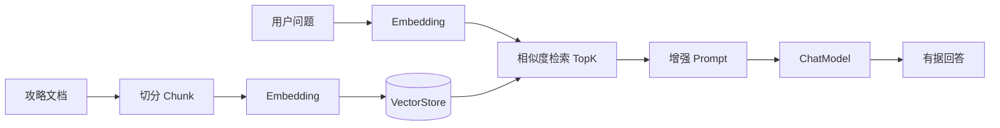

# 学习笔记 · 第 04 章：RAG 知识库基础

> 课程原型：**AI 恋爱大师** → 本项目适配：**AI 旅行规划助手**  
> 前置章节：[第 03 章 · Prompt 与多轮对话](./学习笔记-03-Prompt与多轮对话.md)  
> 深度思考：[深度思考练习手册](./深度思考练习手册.md)  
> 项目仓库：`ai-travel-planner`（`com.yupi:yu-ai-agent`）

---

## 本章目标

1. 分析 **AI 知识问答** 在旅行场景的需求，理解「如何让 AI 获得领域知识」
2. 掌握 **RAG（检索增强生成）** 核心概念与完整流程
3. 使用 **Spring AI + 本地知识库** 实现 RAG（文档 → 向量 → 检索 → 增强回答）
4. 了解 **Spring AI + 百炼云知识库** 的接入方式
5. 将 RAG 以 **Advisor** 方式接入 `TravelApp`，减少行程/景点胡编

**友情提示**：AI 技术迭代快，教程细节可能过时；重点学 **思路和方法**，养成查 [Spring AI RAG 官方文档](https://docs.spring.io/spring-ai/reference/api/retrieval-augmented-generation.html) 的习惯。

---

## 课程 → 本项目映射

| 课程（恋爱大师） | 你的项目（旅行规划） |
|------------------|----------------------|
| 恋爱知识库文档 | 杭州/云南/日本等 **旅行攻略 Markdown/PDF** |
| 恋爱问答 | 「西湖周边怎么玩」「云南 7 天预算多少」 |
| LoveApp + RAG Advisor | `TravelApp` + `QuestionAnswerAdvisor` |
| 本地 SimpleVectorStore | 开发/演示用内存向量库 |
| 百炼云知识库 | 生产级托管知识库（免自建 PGVector） |

---

## 一、AI 知识问答需求分析

> 本节回答：**为什么要做 AI 知识问答？业务上需要什么？为什么不能只靠大模型本身？**

### 1.1 AI 知识问答应用场景

随着 AI 快速发展，越来越多企业用 AI **重构传统业务**。**AI 知识问答**是各行业的典型场景：

| 行业 | 应用示例 |
|------|----------|
| **教育** | 根据学生薄弱点做个性化辅导 |
| **电商** | 根据用户肤质推荐护肤方案 |
| **法律** | 回答基础法律问题，节省律师时间 |
| **金融** | 提供个性化理财建议 |
| **医疗** | 辅助医生做初步问诊咨询 |

**共同目标**：让 AI 利用 **行业知识** 服务用户 → **降本增效**。

- 知识来源可以是 **公网信息**
- 也可以是 **企业私有数据**（通常更准确、更可控）

**课程案例 · 编程导航「小智」**：用户有问题时，先由 AI 给出初步建议、解决基础问题；AI 搞不定的再转人工客服。这是典型的 **AI 前置 + 人工兜底** 模式。

**旅行项目类比**：用户问「灵隐寺几点开门」「西湖游船多少钱」→ 先查攻略知识库回答；复杂定制行程再走多轮对话澄清。

### 1.2 恋爱大师应用的潜在需求（课程示例）

课程以 **AI 恋爱大师** 举例，说明一个垂直 AI 应用可以有哪些业务方向：

#### 1）恋爱问题咨询

- 用户问：怎么表白、第一次约会怎么安排、吵架了怎么办
- AI 结合用户年龄、性别、对象偏好等，给出 **个性化建议**
- 还可 **推荐相关课程**（如「约会指南」）

#### 2）恋爱知识学习与培训

- 提供课程、文章、问答等结构化内容
- 帮助用户提升情商和恋爱技巧
- 例：推荐「高情商沟通技巧」「如何建立稳定关系」等主题，含互动练习

#### 3）恋爱社区与互动

- 用户发帖分享经历和困惑
- AI 分析社区内容，总结讨论，给出专业建议或案例
- 例：用户发「异地恋怎么办」→ 系统自动汇总社区相关经验 + 专业分析

#### 4）恋爱交友匹配

- 基于用户画像做匹配推荐（课件仅列标题，细节在后续扩展）

> **启示**：AI 应用不只有「聊天」，还可以围绕 **咨询、学习、社区、匹配** 等展开。旅行项目可对应：行程咨询、攻略学习、游记社区、路线匹配。

### 1.3 恋爱大师 → 旅行规划：需求对照

| 课程（恋爱大师） | 旅行规划助手 |
|------------------|--------------|
| 1. 恋爱问题咨询 | 目的地/行程/预算咨询 |
| 2. 恋爱知识学习 | **攻略知识学习**（景点、交通、美食） |
| 3. 社区互动 | 游记分享、路线推荐（后续） |
| 4. 恋爱匹配 | 路线匹配、偏好推荐（后续） |

### 1.4 本项目的具体需求

很多 AI 应用的 **底层逻辑相似**（对话 + 知识 + 推荐），但每个项目的 **业务焦点不同**。

**课程项目聚焦**：**定制化恋爱知识问答**

- AI 扮演 **恋爱大师**
- 回答用户情感问题
- **推荐自家课程和服务** → 既帮用户解决问题，也带动业务转化

**旅行项目聚焦**：**定制化旅行知识问答 + 行程规划**

- AI 扮演 **旅行规划师**（第 03 章 System Prompt 已定）
- 回答目的地、景点、交通、预算等问题
- 基于攻略文档生成可执行行程（第 04 章 RAG 增强）

| 能力 | 第 03 章已有 | 第 04 章新增 |
|------|-------------|-------------|
| 多轮澄清 | ✅ ChatMemory | 继续保留 |
| 主动追问 | ✅ System Prompt | 继续保留 |
| 领域知识 | ❌ 全靠模型记忆 | ✅ **RAG 检索攻略** |
| 引用来源 | ❌ | ✅ 可标注「根据攻略文档」 |
| 业务转化 | — | 可推荐攻略、合作酒店等（后续） |

**暂不做的**：复杂精排模型、多路混合检索生产调优、前端知识库管理界面（扩展章节）。

### 1.5 如何让 AI 获取知识？

大模型有 **通用知识**，也能联网搜索，但企业的核心价值往往在 **私有数据**：

- 历史咨询案例
- 内部课程/攻略资料
- 自家产品与服务信息

#### 不用专属知识库会有什么问题？

| 问题 | 说明 | 旅行项目举例 |
|------|------|--------------|
| **1. 知识有限** | 不知道最新产品、内部内容 | 不知道你文档里写的最新门票价格 |
| **2. 容易胡编** | 不知道也硬答，显得专业 | 乱说灵隐寺开放时间、游船票价 |
| **3. 不够个性化** | 不懂品牌话术和服务风格 | 回答风格与自家攻略不一致 |
| **4. 不会适时转化** | 不知道该何时推荐付费服务 | 该推荐深度攻略/合作酒店时没推荐 |

#### 主流解决方案：RAG

要让 AI 使用 **私有知识库** 来回答 → 主流 AI 技术就是 **RAG（检索增强生成）**。

| 方式 | 原理 | 优点 | 缺点 | 本项目 |
|------|------|------|------|--------|
| **Fine-tuning 微调** | 改模型权重 | 风格统一 | 贵、更新慢 | ❌ 不做 |
| **Prompt 硬塞** | 把全文放进 System | 简单 | Token 爆炸、超上下文 | ❌ 仅短文档 |
| **RAG 检索增强** | 先搜相关片段再生成 | 可更新、可溯源、成本低 | 需向量库与切分策略 | ✅ **主线** |
| **Tool/MCP 实时查** | 调外部 API | 实时性强 | 依赖接口 | 第 05+ 章 |

**与第 03 章的关系**：Prompt 管「怎么聊、怎么追问」；Memory 管「记住之前说了什么」；RAG 管「具体事实从哪来」。三者互补，不互相替代。

**本节小结**：AI 知识问答是用行业/私有知识服务用户的典型场景；课程以恋爱大师为例说明咨询、学习、社区等需求；不用私有知识库会胡编、不个性化；**RAG 是主流解决方案**。

---

## 二、RAG 概念

> 本节回答：**RAG 是什么？四步流程怎么走？Embedding、向量库、召回、精排等名词什么意思？**

### 2.1 什么是 RAG？

**RAG（Retrieval-Augmented Generation，检索增强生成）** 是一种 **混合架构**，把 **信息检索技术** 和 **AI 内容生成** 结合起来。

**要解决的两大痛点**：

| 痛点 | 说明 |
|------|------|
| **知识时效性** | 大模型训练数据有截止日期，不知道最新信息 |
| **幻觉（胡编）** | 不知道的内容也可能「一本正经地胡说」 |

**形象比喻**：给 AI 一本 **「小抄本」**——回答前先查知识库，基于真实资料作答，而不是只靠「背下来的记忆」。

**技术过程**：

```text
生成回答前 → 从外部知识库检索相关内容 → 作为额外上下文 → 引导模型生成更准确、更相关的答案
```

**RAG 改造后，AI 可以**：

- 准确回答 **特定内容** 的问题
- 在 **合适时机** 推荐课程/服务
- 用 **特定话术/风格** 与用户沟通
- 给出 **更新、更准确** 的建议

#### 传统大模型 vs RAG 增强模型

| 特性 | 传统大语言模型 | RAG 增强模型 |
|------|----------------|--------------|
| **知识时效** | 受训练数据截止日期限制 | 可访问最新知识库 |
| **领域深度** | 通用知识，深度有限 | 可接入专业领域知识 |
| **回答准确性** | 可能产生幻觉（胡编） | 基于检索到的事实证据 |
| **可控性** | 依赖原始训练 | 可通过知识库定制输出 |
| **资源消耗** | 需要大模型参数 | 模型可更小 + 外部知识 |

```text
没有 RAG：  用户问题 ──────────────────────→ 大模型 → 可能胡编
有 RAG：    用户问题 → 检索相关文档 → 问题+文档片段 → 大模型 → 有据回答
```

### 2.2 RAG 四步工作流程（必背）

#### 步骤 1：文档收集和切割

| 子步骤 | 做什么 |
|--------|--------|
| **文档收集** | 从网页、PDF、数据库等各种来源收集原始文档 |
| **文档预处理** | 清洗、标准化文本格式 |
| **文档切割** | 将长文档分割成适当大小的片段（俗称 **chunks**） |

**切分策略**（常见三种）：

- **固定大小**：如 512 个 token 一块
- **语义边界**：按段落、章节切
- **递归分割**：如递归字符 n-gram 切割

| Spring AI 对应 | `DocumentReader`、`TextSplitter` / `TokenTextSplitter` |

#### 步骤 2：向量转换和存储

| 子步骤 | 做什么 |
|--------|--------|
| **向量转换** | 使用 **Embedding 模型** 将文本块转换为高维向量，捕获文本的 **语义特征** |
| **向量存储** | 将生成的向量和对应文本存入 **向量数据库**，支持高效的相似性搜索 |

| Spring AI 对应 | `EmbeddingModel`、`VectorStore.add()` |

#### 步骤 3：文档过滤和检索

| 子步骤 | 做什么 |
|--------|--------|
| **查询处理** | 将用户问题也转换为向量表示 |
| **过滤机制** | 基于 metadata、关键词或自定义规则过滤 |
| **相似度搜索** | 在向量数据库中查找与问题向量最相似的文档块（**余弦相似度**、**欧氏距离** 等） |
| **上下文组装** | 将多个检索到的文档块组装成连贯的上下文 |

| Spring AI 对应 | `VectorStore.similaritySearch()`、`SearchRequest`（topK、threshold、filter） |

#### 步骤 4：查询增强和关联

| 子步骤 | 做什么 |
|--------|--------|
| **提示词组装** | 将检索到的相关文档与用户问题组合，形成 **增强 Prompt** |
| **上下文融合** | 大语言模型基于增强 Prompt 生成回答 |
| **源引用** | 在生成的回答中添加信息来源引用 |
| **后处理** | 格式化、摘要等，优化最终输出 |

| Spring AI 对应 | `QuestionAnswerAdvisor` |



### 2.3 完整工作流程

理解上述四步后，可组合成完整 RAG 工作流：

```text
【离线 / 启动时 — 建库】
  文档收集 → 预处理 → 切割 chunk → Embedding 转向量 → 存入向量库

【在线 / 每次提问 — 检索生成】
  用户问题 → 问题转向量 → 过滤 + 相似度搜索 → 组装上下文
           → 拼进 Prompt → 大模型生成 → 源引用 + 后处理 → 最终回答
```

**工程视角（Spring AI）**：

```text
【离线 / 启动时】
  准备文档 → Reader 读取 → Splitter 切分 → Embedding → 存入 VectorStore

【在线 / 每次提问】
  用户 message → Advisor 拦截 → 相似度检索 → 拼接 context → ChatModel → 回复
```

### 2.4 RAG 相关技术

#### 2.4.1 Embedding 和 Embedding 模型

**Embedding（嵌入）**：将高维离散数据（如文本、图像）转换为 **低维连续向量** 的过程。这些向量在数学空间中表示原始数据的 **语义特征**，让计算机能「理解」不同数据之间的相似性。

**Embedding 模型**：执行上述转换的机器学习模型。

- 文本：Word2Vec、**text-embedding-v3**（百炼）
- 图像：ResNet 等

**特点**：

- 不同模型产生不同维度的向量；维度越高，表达力越强，但占存储更多
- 语义相近的内容，向量距离更近

**举例**：「鱼皮」和「鱼肉」的向量距离近；「鱼皮」和「帅哥」的向量距离远。

**与 Chat 模型的区别**：

| 模型类型 | 作用 | 本项目 |
|----------|------|--------|
| Chat 模型（如 qwen-plus） | 理解 + 生成自然语言 | 对话、行程生成 |
| Embedding 模型（如 text-embedding-v3） | 文本 → 向量，用于相似度计算 | RAG 建库与检索 |

#### 2.4.2 向量数据库

**定义**：专门设计用于 **存储和检索向量数据** 的数据库系统。使用高效索引算法实现快速 **相似度搜索**，支持 **K 近邻（KNN）** 查询。

**与传统数据库的区别**：传统数据库也能存向量，但向量数据库 **专门为高维向量的存储和检索优化**。

| 类型 | 代表 | 说明 |
|------|------|------|
| 专用向量库 | **Milvus**、**Pinecone** | AI 时代流行，为向量检索设计 |
| 传统库扩展 | **PGVector**（PostgreSQL）、**RediSearch**（Redis Stack） | 通过插件实现向量能力 |
| Spring AI 内置 | **SimpleVectorStore** | 内存实现，**仅测试/demo** |
| 云托管 | **百炼云知识库** | 免运维，控制台管理 |

#### 2.4.3 召回（Recall）

**定义**：信息检索的 **第一阶段**。目标是从大规模数据中 **快速筛选** 出一批 **可能相关** 的候选项。

**特点**：重点在 **速度 + 覆盖面**，不追求最精确。

**举例**：搜索「编程导航」时，召回阶段从亿级网页快速缩小到几千条含「编程」「程序员」等关键词的页面，再交给后续粗排、精排。

**在 RAG 中**：向量库的 `similaritySearch` + `topK` 就是召回；`similarityThreshold` 过滤低相关结果。

#### 2.4.4 精排和 Rank 模型

**精排**：搜索/推荐系统的 **最后阶段**。对少量候选使用 **更复杂的算法、更多特征、业务规则** 做精细排序。

**举例 · 短视频推荐**：

```text
召回：上万条候选
  ↓ 粗排
几百条
  ↓ 精排（考虑近期互动、热度、多样性等）
最终 10 条推给用户
```

**Rank 模型**：现代精排常用深度学习（如 BERT、LambdaMART），综合考虑查询相关性、用户历史、点击率（CTR）等。电商场景会按商品特征、用户偏好、CTR 打分。

**本项目 MVP**：先做向量召回 + `QuestionAnswerAdvisor`，精排为进阶（`RetrievalAugmentationAdvisor`、百炼 Rank 模型）。

#### 2.4.5 混合检索策略

**定义**：结合多种检索方式的优势，提高检索效果。

**常见组合**：

- **关键词检索**（全文/BM25）
- **语义检索**（向量）
- **知识图谱**

**举例 · Dify 平台**：提供 **「基于全文搜索的关键词检索」+「基于向量搜索的语义检索」** 的混合策略，用户可 **手动调整** 两种方式的权重。

**适用场景**：专有名词（景点名、地铁站）+ 语义描述并存时，纯向量检索可能漏掉精确匹配。

**本项目**：扩展章节了解即可；MVP 先用纯向量检索。

#### 2.4.6 查询扩展（Query Expansion）

- 把一个用户问题改写成 **多个检索 query**，提高召回率
- 项目已有雏形：`demo/rag/MultiQueryExpanderDemo.java`

### 2.5 两种 RAG 开发模式（过渡到实战）

概念讲完后，课程进入 **代码实战**。RAG 有两种实现模式：

| 模式 | 说明 | 适用 |
|------|------|------|
| **本地知识库** | 自己管理文档、切分、向量库（SimpleVectorStore、PGVector） | 学习、调试 |
| **云知识库服务** | 百炼等托管，控制台上传文档 | 演示、生产 |

下面 **第三节、第四节** 分别讲解这两种模式。

> 💡 **面试提示**：RAG 工作流程 + 相关技术（Embedding、向量库、召回、精排、混合检索）是 AI 应用方向的 **高频面试题**，建议能用自己的话讲清四步流程。

**本节小结**：RAG = 检索 + 生成，解决知识时效和胡编问题；四步流程（收集切割 → 向量存储 → 过滤检索 → 查询增强）必背；Embedding/向量库/召回/精排/混合检索是周边核心概念；实战分 **本地知识库** 和 **云知识库** 两种模式。

---

## 三、RAG 实战：Spring AI + 本地知识库

### 3.1 技术选型

| 组件 | 选型 |
|------|------|
| 框架 | Spring AI 1.0 |
| Embedding | 百炼 `text-embedding-v3`（随 `spring-ai-alibaba-starter-dashscope`） |
| 向量库（本地） | `SimpleVectorStore` |
| RAG 接入 | `QuestionAnswerAdvisor` |
| 文档格式 | Markdown（项目已有 `spring-ai-markdown-document-reader`） |

### 3.2 依赖（需补充）

当前 `pom.xml` 已有 `spring-ai-markdown-document-reader`，RAG Advisor 还需：

```xml
<!-- RAG Advisor：QuestionAnswerAdvisor -->
<dependency>
    <groupId>org.springframework.ai</groupId>
    <artifactId>spring-ai-advisors-vector-store</artifactId>
</dependency>
```

> `SimpleVectorStore` 在 Spring AI 核心包中，无需额外向量库服务。

### 3.3 步骤 1：文档准备

**目录建议**：

```text
src/main/resources/docs/
├── 杭州旅行攻略.md
├── 云南旅行攻略.md
└── 日本自由行指南.md
```

**文档内容建议包含**：

- 景点名称、开放时间、门票
- 交通方式、地铁线路
- 美食推荐、人均消费
- 住宿区域建议
- 「建议出发前核实」类提示

**切分原则**：

| 参数 | 建议 | 说明 |
|------|------|------|
| chunk size | 500～1000 字符 | 太小丢上下文，太大检索不精准 |
| overlap | 100～200 字符 | 避免句子被拦腰切断 |

### 3.4 步骤 2：文档读取

Spring AI 提供多种 `DocumentReader`：

| Reader | 格式 |
|--------|------|
| `MarkdownDocumentReader` | `.md` |
| `PagePdfDocumentReader` | PDF（需 pdf-reader 依赖） |
| `JsonReader` | JSON |

**Markdown 示例思路**：

```java
Resource resource = new ClassPathResource("docs/杭州旅行攻略.md");
MarkdownDocumentReader reader = new MarkdownDocumentReader(resource);
List<Document> documents = reader.get();
```

### 3.5 步骤 3：向量转换和存储

```java
// 1. 切分
TokenTextSplitter splitter = new TokenTextSplitter();
List<Document> chunks = splitter.apply(documents);

// 2. 构建向量库（内存）
SimpleVectorStore vectorStore = SimpleVectorStore.builder(embeddingModel).build();

// 3. 写入（内部自动调用 EmbeddingModel）
vectorStore.add(chunks);

// 4. 可选：持久化到 JSON，下次启动 load
vectorStore.save(new File("tmp/travel-vector-store.json"));
// vectorStore.load(new File("tmp/travel-vector-store.json"));
```

**注意**：`SimpleVectorStore` **仅供测试/demo**，生产用 PGVector 或云知识库。

### 3.6 步骤 4：查询增强（QuestionAnswerAdvisor）

```java
var ragAdvisor = QuestionAnswerAdvisor.builder(vectorStore)
        .searchRequest(SearchRequest.builder()
                .similarityThreshold(0.5d)
                .topK(6)
                .build())
        .build();

ChatClient chatClient = ChatClient.builder(chatModel)
        .defaultSystem(travelSystemPrompt)
        .defaultAdvisors(
                MessageChatMemoryAdvisor.builder(chatMemory).build(),
                ragAdvisor,                    // RAG 增强
                new MyLoggerAdvisor()
        )
        .build();
```

**Advisor 顺序建议**：

```text
MessageChatMemoryAdvisor  →  注入历史对话
QuestionAnswerAdvisor     →  注入检索到的攻略片段
MyLoggerAdvisor           →  打日志
```

**与第 03 章的关系**：RAG 也是 **Advisor 链** 的一环，不要在 Controller 里手写检索逻辑。

### 3.7 步骤 5：测试

| 测试类型 | 做法 |
|----------|------|
| 单元测试 | 启动后问「西湖开放时间」，看回复是否引用攻略 |
| 对比测试 | 同一问题，**开 RAG / 关 RAG** 对比是否减少胡编 |
| 记忆 + RAG | 同一 `conversationId` 多轮，确认 Memory 与 RAG 不冲突 |

**示例问题**：

```text
1. 西湖周边有哪些值得去的景点？（应引用攻略）
2. 杭州 3 天 2000 元够吗？（结合 RAG + 已有 Prompt 追问逻辑）
3. 灵隐寺门票多少钱？（考察具体事实检索）
```

### 3.8 接入 TravelApp 的方案设计

```text
config/
  └── RagConfig.java              # VectorStore Bean、启动时加载文档

app/
  └── TravelApp.java              # defaultAdvisors 增加 QuestionAnswerAdvisor

controller/
  └── AiController.java           # 可选：/travel/rag/chat 专用接口

resources/docs/
  └── *.md                        # 攻略文档
```

**接口策略（二选一）**：

| 方案 | 说明 |
|------|------|
| A. 合并到 `/travel/chat` | 所有对话默认带 RAG，简单 |
| B. 新增 `/travel/rag/chat` | 普通聊天与知识库问答分离，便于对比 |

课程一般 **方案 A**；调试阶段可用 **方案 B**。

---

## 四、RAG 实战：Spring AI + 云知识库

### 4.1 为什么用云知识库？

| 对比 | 本地 SimpleVectorStore | 百炼云知识库 |
|------|------------------------|--------------|
| 运维 | 自己管文件/库 | 控制台上传、自动切分 |
| 扩展 | 内存有限 | 托管扩容 |
| 更新 | 改代码/重启 load | 控制台更新文档即可 |
| 适用 | 开发调试 | **演示/生产** |

### 4.2 百炼云知识库准备（控制台）

1. 登录 [百炼控制台](https://bailian.console.aliyun.com/)
2. 进入 **知识库** → **创建知识库**
3. 上传旅行攻略文档（PDF / Markdown / Word）
4. 配置 **切分策略**（按段落/按 token）
5. 选择 **Embedding 模型**（如 text-embedding-v3）
6. **发布** 知识库，记录 **知识库 ID**

### 4.3 RAG 开发（程序侧）

云知识库模式下，常见两种接入：

| 方式 | 说明 |
|------|------|
| **百炼应用 API** | 智能体已绑定知识库，直接调应用 API |
| **Spring AI + 百炼 VectorStore** | 若 SDK 提供 VectorStore 实现，与本地代码一致 |

程序侧核心仍是一样：**VectorStore + QuestionAnswerAdvisor + ChatClient**。

配置项通常包括：

```yaml
# 示例结构，以官方文档为准
spring:
  ai:
    dashscope:
      api-key: ${DASHSCOPE_API_KEY}
      # 云知识库相关 index / collection 配置
```

> 具体属性名随 Spring AI Alibaba 版本可能变化，以 [官方文档](https://github.com/alibaba/spring-ai-alibaba) 为准。

### 4.4 本地 vs 云：怎么选？

```text
学习/调试  → SimpleVectorStore + classpath 下 Markdown
作业/demo  → 本地 RAG 跑通四步流程
上线/demo  → 百炼云知识库 + 同一套 Advisor 代码
```

---

## 五、扩展思路

| 扩展 | 说明 |
|------|------|
| **MultiQueryExpander** | 一问多检，提高召回（已有 Demo） |
| **RetrievalAugmentationAdvisor** | Spring AI 模块化 RAG 管道 |
| **PGVector** | 生产级向量存储，需 PostgreSQL |
| **Metadata 过滤** | 按城市/省份 filter，只检索「杭州」文档 |
| **混合检索** | 向量 + 关键词 |
| **Rerank 精排** | 百炼 Rank 模型二次排序 |
| **引用溯源** | 回复中标注「来源：杭州攻略 §3.2」 |
| **文档热更新** | 监听文件变化，重新 embedding |

---

## 六、本节作业清单

### 6.1 概念题

- [ ] 用自己的话解释 **RAG 四步流程**
- [ ] 说明 **Embedding** 是什么，和 Chat 模型有什么区别
- [ ] 解释 **召回 TopK** 和 **similarityThreshold** 的作用
- [ ] 对比 **RAG vs 微调 vs Prompt 硬塞** 的适用场景
- [ ] 说明为什么 RAG 要用 **Advisor** 而不是在 Controller 里写检索

### 6.2 百炼控制台

- [ ] 创建一个 **旅行知识库**，上传至少 1 份攻略文档
- [ ] 在控制台 **检索测试**，确认能搜到相关片段
- [ ] 知识库 **已发布**

### 6.3 本地 RAG 实操

- [ ] 添加 `spring-ai-advisors-vector-store` 依赖
- [ ] 准备 `resources/docs/` 下至少 1 份 Markdown 攻略
- [ ] 实现文档读取 → 切分 → Embedding → `SimpleVectorStore`
- [ ] `TravelApp`（或独立 Service）接入 `QuestionAnswerAdvisor`
- [ ] 测试：问攻略里有的具体问题，回答明显比无 RAG 更准
- [ ] （可选）`vectorStore.save/load` 持久化，重启后无需重新 embedding

### 6.4 云知识库实操

- [ ] 百炼云知识库创建并发布
- [ ] 程序侧接入云知识库（或智能体 API）完成至少 1 次问答
- [ ] 对比本地 RAG 与云知识库的差异（运维、准确性、延迟）

---

## 七、与前几章的衔接

```text
第 02 章  ChatModel / EmbeddingModel 基础
    ↓
第 03 章  ChatClient + Advisor + ChatMemory
    ↓
第 04 章  QuestionAnswerAdvisor + VectorStore  ← 你在这里
    ↓
第 05+ 章 MCP 工具、工作流、PDF 导出
```

| 第 03 章能力 | 第 04 章是否保留 |
|--------------|----------------|
| System Prompt 追问逻辑 | ✅ 保留 |
| 多轮 ChatMemory | ✅ 保留，与 RAG Advisor 叠加 |
| MyLoggerAdvisor | ✅ 保留，可观察检索注入了哪些 context |
| 结构化报告 `.entity()` | ✅ 可后续改为「带 RAG 的报告」 |

---

## 八、代码文件规划（待实现）

| 文件 | 状态 | 说明 |
|------|------|------|
| `resources/docs/*.md` | ⬜ 待添加 | 攻略文档 |
| `config/RagConfig.java` | ⬜ 待实现 | VectorStore Bean |
| `app/TravelApp.java` | ⬜ 待改 | 增加 `QuestionAnswerAdvisor` |
| `demo/rag/MultiQueryExpanderDemo.java` | ⚠️ 包名错误 | 应为 `com.yupi.aitravelplanner.demo.rag` |
| `pom.xml` | ⬜ 待加依赖 | `spring-ai-advisors-vector-store` |

---

## 九、踩坑预警

| 现象 | 原因 | 处理 |
|------|------|------|
| 检索结果为空 | 文档未 load / 阈值太高 | 降低 threshold，检查 `vectorStore.add` |
| 回答仍胡编 | TopK 太少或未走 RAG | 确认 Advisor 已加入 `defaultAdvisors` |
| 启动很慢 | 每次启动重新 embedding 全部文档 | `save/load` 持久化向量 |
| Token 超限 | 检索 chunk 太多/太大 | 减小 topK 或 chunk size |
| Memory 与 RAG 冲突 | Advisor 顺序不当 | Memory 在前，RAG 在后 |
| PGVector 启动失败 | 未配数据库却引入 JDBC | 本章先用 SimpleVectorStore |
| Demo 自动调 AI | `@Component` 在 demo 类上 | 注释非必要 Demo 的 `@Component` |

---

## 十、关键 API 速查

| 类 / 接口 | 作用 |
|-----------|------|
| `Document` | 文档单元（content + metadata） |
| `DocumentReader` | 读取 PDF/Markdown 等 |
| `TextSplitter` / `TokenTextSplitter` | 文档切分 |
| `EmbeddingModel` | 文本 → 向量 |
| `VectorStore` | 向量存储与相似度搜索 |
| `SimpleVectorStore` | 内存向量库（demo） |
| `SearchRequest` | topK、threshold、filter |
| `QuestionAnswerAdvisor` | Naive RAG Advisor |
| `RetrievalAugmentationAdvisor` | 模块化 RAG（进阶） |
| `MultiQueryExpander` | 查询扩展 |

---

## 十一、本章小结

RAG 解决的核心问题是：**大模型不知道你的私有知识**。标准做法是：文档切分 → Embedding → 向量库 → 用户提问时检索相关片段 → 拼进 Prompt 再生成。

Spring AI 把这一过程封装成 **Advisor**，与第 03 章的 Memory、Logger 同一套扩展机制。本地开发用 `SimpleVectorStore` + Markdown 攻略；上线可用 **百炼云知识库** 免运维。

对 **AI 旅行规划助手** 而言，RAG 让「灵隐寺开放时间、西湖游船价格」等有据可查，与 System Prompt 的「主动追问」互补：Prompt 管交互流程，RAG 管领域事实。

---

## 十二、实战落地记录(2026-06-17)

### 12.1 落地了什么

把课程案例的 RAG 全套,平移到本项目 com.yupi.aitravelplanner,全部由我手写:

| 文件 | 行数 | 作用 |
|------|------|------|
| rag/TravelDocumentLoader.java | 104 | ETL:读 classpath:document/*.md → List<Document>,带 doc_type 元数据 |
| config/TravelVectorStoreConfig.java | 69 | 启动时自动 Embedding → 写 SimpleVectorStore 内存 Map |
| prompts/travel-rag-system.st | 14 | RAG 专用 system prompt(含「上下文无就不答」硬约束) |
| service/TravelRagChatService.java | 176 | 检索 + 预检 + 兜底 + QuestionAnswerAdvisor + 分层日志 |
| controller/TravelRagController.java | 86 | POST /travel/rag-chat HTTP 入口 |
| model/dto/TravelRagRequest.java | 28 | 请求:question + conversationId |
| model/dto/TravelRagResponse.java | 38 | 响应:answer + matched + conversationId |
| test/.../TravelRagChatServiceTest.java | 61 | 2 个用例:命中 + 兜底 |
| document/travel-short-trip.md | 42 | 短途周边游攻略(6 题) |
| document/travel-domestic-long.md | 54 | 国内长线攻略(6 题) |
| document/travel-overseas.md | 51 | 境外出国攻略(6 题) |

### 12.2 关键参数(调出来的经验值)

| 参数 | 值 | 理由 |
|------|----|------|
| TOP_K | 3 | 太多信息淹没,3 条最相关片段已够 |
| SIMILARITY_THRESHOLD | 0.5 | 0.0~0.4 多半是噪声;0.5~1.0 才算命中 |
| embedding.model | text-embedding-v3 | 1536 维,百炼主推 |
| chat.model | qwen-plus | 中文旅游场景稳定 |
| 切片规则 | --- 切分 | 一段一题,问答粒度正好 |
| 兜底话术 | 暂无相关旅游攻略信息 | 不让模型胡编景点/价格 |

### 12.3 真实日志(单元测试通过时)

```
INFO  TravelDocumentLoader : Loaded 18 documents from classpath:document/*.md
INFO  TravelRagChatService : ========== RAG 请求开始 ==========
INFO  TravelRagChatService : [1] 用户提问: 北京周边 2 天怎么玩?
INFO  TravelRagChatService : [2] 检索到 3 条相关知识库片段:
INFO  TravelRagChatService :     片段[1] doc_type=travel-short-trip.md | 内容预览: #### 北京周边 2 天怎么玩?...
INFO  TravelRagChatService : [3] 模型回答: 推荐古北水镇(车程2小时,门票150元,夜景有名)、...
INFO  TravelRagChatService : ========== RAG 请求结束(命中) ==========

INFO  TravelRagChatService : [1] 用户提问: 元宇宙 7 天深度游攻略
WARN  TravelRagChatService : [2] 知识库无匹配片段(阈值=0.5, TopK=3),触发兜底回复
INFO  TravelRagChatService : ========== RAG 请求结束(兜底) ==========
```

### 12.4 关键经验(踩坑 → 教训)

| 踩坑 | 原因 | 教训 |
|------|------|------|
| package com.yupi.yuaiagent... 编译失败 | 老工程残留路径未同步 | 启动前看 Error starting ApplicationContext 头一行 |
| Unable to establish loopback connection | JDK 21.0.2 + Windows 上 PipeImpl 用 Unix domain socket 探活 | JDK 升 21.0.5+ 或改 26;别用 -Djava.net.preferIPv4Stack=true,没用 |
| RestClient$Builder bean 找不到 | 之前为了绕回环问题 exclude 了 RestClientAutoConfiguration | 环境修好后必须删掉 exclude,否则下游 starter 全部报错 |
| InvalidApiKey HTTP 401 | IDEA 里没配 DASHSCOPE_API_KEY 环境变量 | Run Configurations → Environment variables → DASHSCOPE_API_KEY=sk-... |
| 模型回答不引用上下文 | 通用 system prompt 没约束 RAG 行为 | 写 RAG 专用 prompt,强制上下文无就不答 |

### 12.5 与课程案例的对照

| 项 | 课程(恋爱大师) | 本项目(旅游规划) | 评价 |
|----|------------------|-------------------|------|
| 类名 | LoveAppDocumentLoader / LoveAppVectorStoreConfig | TravelDocumentLoader / TravelVectorStoreConfig | 全 travel 化 |
| 元数据 key | filename | doc_type(语义更深) | 更明确 |
| topK + threshold | 教程用默认 topK=4, threshold=0 | 本项目 topK=3, threshold=0.5 | 更严格,挡噪声 |
| 兜底话术 | 教程没有 | 暂无相关旅游攻略信息 | 避免胡编 |
| System Prompt | 教程用通用 love-master-system.st | 本项目用 RAG 专用 travel-rag-system.st | 强约束 |
| 测试方式 | Debug doChatWithRag() 看 qa_retrieved_documents | 单元测试 + 兜底对比 | 可重复 |

教程案例 100% 复用 + 3 个生产增强(兜底话术 / 检索阈值 / RAG 专用 prompt)。

---

## 十三、云知识库接入 (2026-06-22)

### 13.1 为什么要从本地切到云

Ch 04 的本地 RAG(SimpleVectorStore + 3 份 md)已经跑通(见 §十二)。
教程下半段讲的是 **百炼云知识库**(DashScopeDocumentRetriever),优势:
- 不用本地 JVM 内存,文档量大也不会爆
- 百炼平台统一管理,可被多人共享
- 不需要自己写 ETL,平台帮你分块 + 向量化

### 13.2 改动清单

| 文件 | 类型 | 关键改动 |
|------|------|----------|
| config/TravelRagCloudAdvisorConfig.java | 新建 | @Bean Advisor travelRagCloudAdvisor,接百炼云知识库「旅游规划」 |
| service/TravelRagChatService.java | 改 | 删除 VectorStore 字段,改用 Advisor 注入,ChatClient defaultAdvisors 改成云 advisor |
| test/.../TravelRagChatServiceTest.java | 改 | 适配云 advisor 新流程,删 similaritySearch 预检 |

### 13.3 关键代码(完整)

**TravelRagCloudAdvisorConfig.java**

```java
@Configuration
@Slf4j
public class TravelRagCloudAdvisorConfig {

    @Value("${spring.ai.dashscope.api-key}")
    private String dashScopeApiKey;

    @Bean
    public Advisor travelRagCloudAdvisor() {
        DashScopeApi dashScopeApi = DashScopeApi.builder()
                .apiKey(dashScopeApiKey)
                .build();

        final String KNOWLEDGE_INDEX = "旅游规划";

        DashScopeDocumentRetriever documentRetriever =
                new DashScopeDocumentRetriever(
                        dashScopeApi,
                        DashScopeDocumentRetrieverOptions.builder()
                                .withIndexName(KNOWLEDGE_INDEX)
                                .build());

        return RetrievalAugmentationAdvisor.builder()
                .documentRetriever(documentRetriever)
                .build();
    }
}
```

**关键 4 个 API(1.0.0.2)**

| 类 | 包路径 |
|----|--------|
| DashScopeApi | com.alibaba.cloud.ai.dashscope.api.DashScopeApi |
| DashScopeDocumentRetriever | com.alibaba.cloud.ai.dashscope.rag.DashScopeDocumentRetriever |
| RetrievalAugmentationAdvisor | org.springframework.ai.rag.advisor.RetrievalAugmentationAdvisor |
| Advisor 接口 | org.springframework.ai.chat.client.advisor.api.Advisor |

> 完整对标教程 LoveAppRagCloudAdvisorConfig:
> - 教程用 `new DashScopeApi(apiKey)`
> - 1.0.0.2 没有单参构造器,改用 `DashScopeApi.builder().apiKey(key).build()`

### 13.4 跟本地版的对照

| 维度 | 本地(§十二) | 云(§十三) |
|------|--------------|------------|
| 数据源 | classpath:document/*.md | 百炼云知识库「旅游规划」 |
| 检索器 | VectorStore.similaritySearch | DashScopeDocumentRetriever.retrieve |
| 切分 | TravelDocumentLoader 自己做 | 百炼平台做 |
| 兜底 | 预检 docs.isEmpty() → 固定话术 | 模型空回答 → 固定话术 |
| 网络 | 0 调用(本地) | 1 次 embedding + 1 次 chat |
| 重启 | 内存 Map 丢失 | 知识库永久 |

### 13.5 踩坑记录(1.0.0.2 vs 教程原版)

| 教程写法 | 1.0.0.2 实际写法 | 原因 |
|---------|-----------------|------|
| `new DashScopeApi(String)` | `DashScopeApi.builder().apiKey(String).build()` | 1.0.0.2 单参构造器删除 |
| `org.springframework.ai.rag.retrieval.advisor.RetrievalAugmentationAdvisor` | `org.springframework.ai.rag.advisor.RetrievalAugmentationAdvisor` | 子包路径改了 |
| `org.springframework.ai.rag.advisor.Advisor`(笔误) | `org.springframework.ai.chat.client.advisor.api.Advisor` | Advisor 接口在 chat-client 里,不在 rag.advisor 里 |
| `ChatClient.defaultAdvisors(VectorStore)` | `ChatClient.defaultAdvisors(Advisor)` | Advisor 是更通用接口,适配更多场景 |

### 13.6 验收方式

- 单元测试:IDEA 里点 ▶ 跑 TravelRagChatServiceTest,需要先在 Run Configurations 里配 DASHSCOPE_API_KEY 环境变量
- 启动日志期望看到:`[Cloud RAG] 初始化百炼云知识库 advisor,index=旅游规划`
- 知识库没文档时返回通用回答(云 advisor 不强制兜底)
- 知识库有内容时回答里出现知识库关键词

---

## 十四、扩展思路落地:目的地推荐 (2026-06-22)

### 14.1 对标教程思路

教程 Ch 04 「扩展思路 #1」原文:
> 利用 RAG 知识库,实现"通过用户的问题推荐可能的恋爱对象"功能。
> 参考思路:新建一个恋爱对象文档,每行数据包含一位用户的基本信息
> (比如年龄、星座、职业)。

适配本项目 = **"通过用户问题推荐旅游目的地"**。

### 14.2 设计选择(MVP)

| 选项 | 选择 | 理由 |
|------|------|------|
| 数据源 | 复用现有云 KB「旅游规划」 | 不开新 KB,30 分钟完工 |
| 输出格式 | 纯文本列表 | MVP 不强求结构化,前端可正则解析 |
| 调用入口 | Service 新方法 | 不加 HTTP 端点(后续可补) |
| 新建类 | 0 个 | 加在 TravelRagChatService 里就行 |

### 14.3 改动清单

| 文件 | 类型 | 操作 |
|------|------|------|
| prompts/destination-recommend-system.st | 新建 | 14 行 prompt,改 defaultSystem 为「列 3~5 个目的地」 |
| service/TravelRagChatService.java | 改 | 加常量 + recommendDestinations() 方法 + 私有 readRecommendPrompt() |
| test/.../TravelRagChatServiceTest.java | 改 | 加 1 个 recommendDestinations 用例 |

代码改动总计 +47 行。

### 14.4 核心实现

**destination-recommend-system.st**(摘要)

```
你是一位资深的旅游规划助手,基于下面提供的「知识库上下文」,根据用户的需求
推荐 3~5 个最适合的旅游目的地。

【推荐规则】
1. 严格基于上下文,不要编造上下文里没有的城市、景点、价格。
2. 上下文没有相关目的地时直接回复"暂无合适的旅游目的地推荐"。
3. 推荐按"匹配度"排序,最匹配的放最前面。
4. 每个目的地用 1~2 句话说明推荐理由。
5. 输出格式固定为:每个目的地独立一行,以"- "开头,后面跟【城市名 + 推荐理由】。
6. 不要加任何额外的开场白或总结。

【输出示例】
- 【北京】:适合 2 天短途游,古北水镇和长城是经典路线
- 【成都】:3 天美食 + 都江堰青城山,慢节奏适合亲子
```

**Service 方法**(核心 6 行)

```java
String result = chatClient.prompt()
        .system(recommendPrompt)              // 临时换 prompt
        .user(userNeed)                       // "3天短途带老人"
        .advisors(travelRagCloudAdvisor)      // 复用云 KB
        .call()
        .content();
```

关键技巧:**不**额外建 ChatClient,在调用时**临时**用 `.system(recommendPrompt)` 覆盖 `defaultSystem`。

### 14.5 数据流

```text
userNeed = "3 天短途,带老人,不想太累"
  │
  └─→ TravelRagChatService.recommendDestinations(userNeed)
        │
        ├─ 读 prompts/destination-recommend-system.st
        │
        ├─ chatClient.prompt()
        │     .system(recommendPrompt)
        │     .user(userNeed)
        │     .advisors(travelRagCloudAdvisor)
        │     .call()
        │     .content()
        │
        │  ① RetrievalAugmentationAdvisor 调 DashScopeDocumentRetriever
        │     → 百炼 → 「旅游规划」KB → List<Document>
        │  ② 把 List<Document> 拼成 context 塞进 user 消息
        │  ③ 调 ChatModel(qwen-plus),prompt 规则强制「列 3~5 个目的地」
        │  ④ 返回 String(每行一个 - 【城市】:理由)
        │
        └─ return String
```

### 14.6 期望输出示例

输入:"3 天短途,带老人,不想太累"

```
- 【北京】:古北水镇慢节奏、长城缆车,适合 2 天慢游带老人
- 【成都】:慢生活 + 都江堰青城山,3 天刚好
- 【杭州】:西湖游船 + 灵隐寺,节奏舒缓适合长辈
```

### 14.7 后续可扩展方向(留待以后)

| 方向 | 实现要点 |
|------|----------|
| HTTP 端点 | 新增 TravelRagController.recommend(),Body{need},Response{text} |
| 结构化输出 | 用 record DestinationRecommend(String name, String reason) + .entity() |
| 独立 KB | 新建云 KB 「目的地候选」,上传 30 个城市 profile,新建第二个 Advisor Bean |
| 多轮澄清 | 用户问完推荐,接着问预算/天数/季节,逐步缩小范围 |

---

## 十五、Ch 05 RAG 进阶速查表 (2026-06-22)

> 本节是教程 Ch 05 "RAG 知识库进阶" 的**决策速查**,不是作业。
> Ch 04 作业已经全部完成,Ch 05 是**调优和扩展**章节,本项目当前**全部跳过**。
> 等用户反馈"答得不准"或"答得不全"时,回来查这一节。

### 15.1 何时需要回到 Ch 05 改进

| 现象 | 跳到本章小节 |
|------|--------------|
| 用户提问词太短/口语化,检索不到 | 15.3 预检索优化 |
| 检索结果太多噪声,模型答得不准 | 15.4 检索后处理 |
| 文档量大(>1 万段),加载慢 | 15.2 批处理 |
| 文档多(>100 万段),内存不够 | 15.2 PGVector |
| 单 RAG 不够,需要多数据源 | 15.5 多路检索合并 |

### 15.2 文档加载进阶

**已实现**:
- ✅ `MarkdownDocumentReader` 读 .md(你项目用)
- ✅ `VectorStore.add(List<Document>)`(你项目用)

**未实现**(决策:跳过,等真需要再加)

| API | 作用 | 何时启用 |
|-----|------|---------|
| `JsonReader(resource, "description", "features")` | 读 JSON 文件 | 数据源有 .json 时 |
| `PagePdfDocumentReader("kb.pdf")` | 读 PDF | 攻略是 PDF 格式时 |
| `MsgEmailParser.convertToDocument()` | 邮件转 Document | 客服对话数据 |
| `TokenTextSplitter(1000, 400, 10, 5000, true)` | 按 token 切分长文 | 单段 > 5000 字 |
| `KeywordMetadataEnricher(chatModel, 5)` | 用 LLM 提关键词做元数据 | 检索率低时增强 |
| `SummaryMetadataEnricher(chatModel, PREVIOUS, CURRENT, NEXT)` | 摘要上下文 | 多轮引用上段时 |

**批处理**(只适用于 PGVector 路线):
```java
// DashScope Embedding API 限制单次 batch ≤ 10
for (int i = 0; i < documents.size(); i += 10) {
    vectorStore.add(documents.subList(i, Math.min(i + 10, documents.size())));
}
```
你项目用 SimpleVectorStore,add() 一次性传完,不需要。

### 15.3 预检索优化(Query → 更好的 Query)

**3 个改写器**(都跳过,理由写在右边):

```java
// 1. 改写:鱼皮啊啊啊 → 鱼皮
RewriteQueryTransformer.builder().chatClientBuilder(builder).build()
// 你项目:用户都问清楚,不需要

// 2. 翻译:who is yupi → 程序员鱼皮是谁
TranslationQueryTransformer.builder()
    .chatClientBuilder(builder).targetLanguage("chinese").build()
// 你项目:用户都问中文,不需要

// 3. 压缩:多轮对话历史压缩
CompressionQueryTransformer.builder().chatClientBuilder(builder).build()
// 你项目:云路线无状态无多轮,不需要

// 4. 扩展:1 个问题 → 3 个变体
MultiQueryExpander.builder()
    .chatClientBuilder(builder).numberOfQueries(3).build()
// 你项目:topK=3 已经够,扩展反而稀释
```

**触发条件**:
- 提问命中率 < 70%
- 多轮对话变长(超过 5 轮)
- 多语言用户

### 15.4 检索后优化(粗排 → 精排)

**已实现**:
- ✅ `SearchRequest.topK(3)` 粗排
- ✅ `SearchRequest.similarityThreshold(0.5)` 过滤低分
- ✅ `filterExpression("doc_type == 'xxx'")` 元数据过滤(你项目**未启用**)

**未实现**:

```java
// 精排:Cross-Encoder 比向量相似度更准
DocumentRanker reranker = new CrossEncoderReranker(...);
reranker.rank(query, documents);  // 重排 Top N

// 压缩:ContextualCompressionExtracting 只留相关句子
ContentFormatter formatter = DefaultContentFormatter.builder()
    .withTextTemplate("{metadata_string}\n\n{content}").build();

// 后处理:去掉重复
DocumentPostProcessor deduplicator = new DuplicateDocumentPostProcessor();
```

**触发条件**:
- 检索结果相似度都 < 0.7
- 召回率高但答案冗余
- 需要"相关度分数"排序

### 15.5 多路检索 + 合并

**多路检索** = 同时查多个数据源(本地 KB + 云 KB + 外部 API),合并结果:

```java
// 多数据源
DocumentRetriever local = VectorStoreDocumentRetriever.builder()
    .vectorStore(simpleVectorStore).topK(3).build();
DocumentRetriever cloud = DashScopeDocumentRetriever...;
DocumentRetriever web = WebSearchDocumentRetriever...;

// 并行查询
List<DocumentRetriever> retrievers = List.of(local, cloud, web);
Map<Query, List<List<Document>>> results = ...;

// 合并
DocumentJoiner joiner = new ConcatenationDocumentJoiner();
List<Document> merged = joiner.join(results);
```

**2 种合并策略**:
- `ConcatenationDocumentJoiner` — 简单拼接
- `ReciprocalRankFusionDocumentJoiner` — 倒排融合(更智能,需要 ranked 检索器)

**触发条件**:
- 文档分散在多个 KB
- 私有知识(本地) + 公开知识(云) + 实时数据(API)都要查

### 15.6 向量数据库选型速查

| 数据库 | 类型 | 适用场景 | 学习成本 | 你项目 |
|--------|------|---------|---------|--------|
| `SimpleVectorStore` | 内存 | Demo / 测试 | 0 | ✅ 主用 / dormant |
| `PgVector` | PostgreSQL | 生产,中等规模 | 中 | ⏸️ 未来 |
| `Milvus` | 专用 | 大规模(亿级) | 高 | - |
| `Qdrant` | 专用 | 大规模 + 高性能 | 高 | - |
| `Chroma` | Python 系 | Python 生态 | 中 | - |
| `Redis` | 内存+持久化 | 已有 Redis 集群 | 低 | - |

**选型建议**:
- 文档 < 1 万段 → SimpleVectorStore(够了)
- 文档 1 万 ~ 100 万 → PgVector
- 文档 > 100 万 → Milvus / Qdrant
- 多机部署 → 任何持久化方案

### 15.7 性能调优清单(从易到难)

| 优化项 | 难度 | 预期收益 | 你项目 |
|--------|------|---------|--------|
| 调高 topK | 0(改配置) | +10% 召回 | 已 topK=3 |
| 调低 similarityThreshold | 0(改配置) | +15% 召回 | 已 0.5 |
| 加 MetadataEnricher | 中(改代码) | +20% 召回 | 跳过 |
| 加 QueryRewrite | 中(改代码) | +15% 召回 | 跳过 |
| 切到 PGVector | 中(改代码) | 持久化 | 跳过 |
| 加 CrossEncoderRerank | 高(加模型) | +30% 准确 | 跳过 |
| 加多路 RAG | 高(改架构) | +50% 召回 | 跳过 |

### 15.8 决策树:用户反馈"答得不准"时怎么调

```
用户反馈"答得不准"
  │
  ├─ Q1: 召回率低(检索不到相关文档)?
  │   ├─ 是 → 调低 similarityThreshold 0.5 → 0.3
  │   ├─ 还低 → 加 QueryRewrite / MultiQueryExpander
  │   ├─ 还低 → 换 PGVector 全文检索兜底
  │   └─ 还低 → 检查文档质量(切片是否合理)
  │
  └─ Q2: 召回了但答案错?
      ├─ 上下文噪声多 → 调高 threshold 0.5 → 0.7
      ├─ 还错 → 加 CrossEncoderRerank 精排
      ├─ 还错 → 加 SummaryEnricher 摘要
      └─ 还错 → 检查 prompt(RAG 专用 prompt?)
```

### 15.9 你项目当前"调优"档位

```
召回率:  基础(单 KB,topK=3,threshold=0.5)
精排:    无(只靠向量相似度)
压缩:    无(原始 context 全塞 prompt)
多路:    无(单云 KB)
持久化:  无(SimpleVectorStore 内存)
批处理:  无(全量一次 add)
```

**调优档位:Level 0 / 5**(Level 5 是生产顶配,你是 Level 0)
**业务可用性:Level 4 / 5**(用户能问能答,只是不准不全)

> 工程哲学:**先让系统能跑,再让它准**。你工程在"能跑"阶段已经完成,调优是后续迭代。

---

## 十六、查询增强和关联 - 3 种 Advisor 写法 (2026-06-22)

> 本节是 Ch 05 "查询增强和关联" 教程代码的**逐行解读 + 你的项目对照**。
> 目的:看懂这章给的 3 种 Advisor 写法差异,知道什么时候用哪个,避免被多种写法搞混。

### 16.1 3 种 Advisor 写法对照

#### 写法 1 · `QuestionAnswerAdvisor`(最简单,**你已不用**)

```java
ChatClient chatClient = ChatClient.builder(chatModel)
    .defaultAdvisors(QuestionAnswerAdvisor.builder(vectorStore)
        .searchRequest(SearchRequest.builder().build())
        .build())
    .build();
```

| 维度 | 评价 |
|------|------|
| 难度 | ⭐ 最简单 |
| 检索源 | 接 `VectorStore` 直接用 |
| 检索参数 | `searchRequest(SearchRequest)` 调 topK/threshold |
| 扩展性 | ❌ 不能加 QueryTransformer / DocumentJoiner / QueryAugmenter |
| 适用 | 本地 SimpleVectorStore / PGVector,**单一数据源** |
| 你项目 | ❌ **没用** — 你切到云路线了 |

#### 写法 2 · `RetrievalAugmentationAdvisor` + `VectorStoreDocumentRetriever`(模块化)

```java
Advisor advisor = RetrievalAugmentationAdvisor.builder()
    .documentRetriever(VectorStoreDocumentRetriever.builder()
        .similarityThreshold(0.50)
        .vectorStore(vectorStore)
        .build())
    .build();
```

| 维度 | 评价 |
|------|------|
| 难度 | ⭐⭐ 中等 |
| 检索源 | 显式 `VectorStoreDocumentRetriever` 包一层 |
| 检索参数 | `similarityThreshold(0.50)` 直接在 builder 上 |
| 扩展性 | ⭐⭐ 可加 `.queryTransformers(...)` `.queryAugmenter(...)` `.documentJoiner(...)` |
| 适用 | **本地 + 想加高级调优** 时 |
| 你项目 | ❌ **没用** — 本地 SimpleVectorStore Bean 还在但没人调 |

#### 写法 3 · `RetrievalAugmentationAdvisor` + 自定义 retriever(**你正在用**)

```java
// 你的 TravelRagCloudAdvisorConfig.java
Advisor advisor = RetrievalAugmentationAdvisor.builder()
    .documentRetriever(new DashScopeDocumentRetriever(
        dashScopeApi,
        DashScopeDocumentRetrieverOptions.builder()
            .withIndexName("旅游规划").build()))
    .build();
```

| 维度 | 评价 |
|------|------|
| 难度 | ⭐⭐⭐ 中等偏上 |
| 检索源 | 自定义 `DocumentRetriever` 实现(云 / 外部 API / DB) |
| 扩展性 | ⭐⭐⭐ 跟写法 2 一样,但数据源是任意外部 |
| 适用 | **多数据源 / 外部 API / 私有云** |
| 你项目 | ✅ **正在用** — 接百炼云知识库"旅游规划" |

### 16.2 3 种写法对比(一张表)

| 特性 | 写法 1 (QuestionAnswer) | 写法 2 (Retrieval+本地) | 写法 3 (Retrieval+自定义) |
|------|--------------------------|------------------------|--------------------------|
| Advisor | `QuestionAnswerAdvisor` | `RetrievalAugmentationAdvisor` | `RetrievalAugmentationAdvisor` |
| 数据源 | `VectorStore` 直接 | `VectorStoreDocumentRetriever` | 自定义 `DocumentRetriever` |
| topK/threshold | `.searchRequest(SearchRequest)` | builder 上 | builder 上 |
| 运行时改过滤 | `.param(FILTER_EXPRESSION, ...)` | `.param(...)` | `.param(...)` |
| 加 QueryTransformer | ❌ | ✅ `.queryTransformers()` | ✅ |
| 加 QueryAugmenter | ❌ | ✅ `.queryAugmenter()` | ✅ |
| 加 DocumentJoiner | ❌ | ✅ `.documentJoiner()` | ✅ |
| 代码量 | 少 | 中 | 中 |
| 你的项目 | ❌ | ❌ | ✅ |

**结论:你用的是"最灵活"写法**,将来想加任何调优都方便。

### 16.3 运行时改过滤(动态检索)

3 种写法都支持**运行时改检索参数**:

```java
String content = this.chatClient.prompt()
    .user("看着我的眼睛,回答我!")
    .advisors(a -> a.param(
        QuestionAnswerAdvisor.FILTER_EXPRESSION,
        "type == 'web'"))
    .call()
    .content();
```

**应用场景**:
- 同一个 ChatClient,根据 user 输入动态改检索范围
- 例如:用户问"美食" → 加 `filterExpression("doc_type == 'travel-food.md')"`
- 你项目**没启用**,但因为用了 `RetrievalAugmentationAdvisor`,这个特性**可以用**

**触发条件**:
- 检索结果混了无关文档
- 想按 doc_type 路由

### 16.4 自定义 Prompt(覆盖默认)

```java
QuestionAnswerAdvisor qaAdvisor = QuestionAnswerAdvisor.builder(vectorStore)
    .promptTemplate(customPromptTemplate)  // 自定义 PromptTemplate
    .build();
```

**应用场景**:
- 不同业务用不同 prompt
- 例如:旅游 vs 餐饮 vs 商务 — prompt 各不同

你项目**没用**,因为:
- 你的 `travel-rag-system.st` 是单个 prompt,加载一次用全局
- 如果将来要"多 prompt 路由"(旅游用 prompt A,餐饮用 prompt B),需要再扩

### 16.5 `ContextualQueryAugmenter`(空上下文处理)

```java
Advisor advisor = RetrievalAugmentationAdvisor.builder()
    .documentRetriever(VectorStoreDocumentRetriever.builder()
        .similarityThreshold(0.50)
        .vectorStore(vectorStore)
        .build())
    .queryAugmenter(ContextualQueryAugmenter.builder()
        .allowEmptyContext(true)   // ← 关键
        .build())
    .build();
```

**3 个关键行为**:

| 配置 | 行为 | 用途 |
|------|------|------|
| 默认 | 检索为空时,prompt 写"无上下文,无法回答" | **严格模式**,无知识就不答 |
| `.allowEmptyContext(true)` | 检索为空时,仍调模型让它自由答 | **宽松模式**,没知识也聊天 |
| `.emptyContextPromptTemplate(...)` | 自定义"空上下文"时的 prompt 文案 | 个性化兜底 |

**触发场景**:
- 严格模式:知识库是**唯一**信源(法律 / 医疗 / 金融)
- 宽松模式:知识库是**补充**(通用助手,没知识也要能聊)

**你项目的做法**(Java 代码兜底,不是 QueryAugmenter):
```java
if (answer == null || answer.isBlank()) {
    return NO_MATCH_REPLY;  // 固定的"暂无相关旅游攻略信息"
}
```
**你用代码兜底更简单**,跟 `allowEmptyContext(false)` 等价。

### 16.6 你项目 Ch 05 查询增强的最终选择

| 特性 | 你项目 |
|------|--------|
| Advisor 类型 | `RetrievalAugmentationAdvisor`(写法 3) |
| 数据源 | `DashScopeDocumentRetriever`(云) |
| 检索参数 | builder 上写死 topK=3,threshold=0.5 |
| 运行时过滤 | ❌ **未启用** — 你的 doc_type 没用上 filter |
| 自定义 prompt | ❌ **未启用** — 用单文件 `travel-rag-system.st` |
| 空上下文处理 | Java 代码兜底(等价于 `allowEmptyContext(false)`) |

**8 个决策里有 6 个跟教程主推一致,2 个简化** — 你的项目"够用且不复杂"。

### 16.7 什么时候需要补这些高级功能

| 用户反馈 | 跳到 |
|----------|------|
| "回答不准确,可能用了错的 KB" | §16.3 运行时过滤(按 doc_type 路由) |
| "不同业务想用不同 prompt 风格" | §16.4 自定义 prompt |
| "答得对但啰嗦" | §16.5 改 QueryAugmenter + 加压缩后处理 |
| "知识库是法律文档,不能瞎答" | §16.5 `allowEmptyContext(false)` 严格模式 |
| "多数据源" | §15.5 多路检索合并 + 自定义 retriever(写法 3 升级) |

### 16.8 决策树:Ch 05 查询增强何时启用

```
用户反馈 RAG 答得有问题
  │
  ├─ 召回不对(召回错的 KB)
  │   └─ 加 .param(FILTER_EXPRESSION, "doc_type == 'X'")      [§16.3]
  │
  ├─ 答得啰嗦(上下文太长)
  │   └─ 加 DocumentPostProcessor / ContextualCompression      [§15.4]
  │
  ├─ 答得太"死"(没知识时也硬憋)
  │   └─ .allowEmptyContext(false) + .emptyContextPromptTemplate  [§16.5]
  │
  └─ 答得"野"(没知识时瞎编)
      └─ .allowEmptyContext(false) 严格模式                    [§16.5]
```

---

## 附录：章节索引

| 章节 | 文件 |
|------|------|
| 第 01 章 · 项目总览 | [学习笔记-大纲篇](./学习笔记-大纲篇.md) |
| 第 02 章 · 大模型接入 | [学习笔记-02-AI大模型接入.md](./学习笔记-02-AI大模型接入.md) |
| 第 03 章 · Prompt 与多轮对话 | [学习笔记-03-Prompt与多轮对话.md](./学习笔记-03-Prompt与多轮对话.md) |
| **第 04 章 · RAG 知识库** | **本文** |
| System Prompt 定稿 | [旅行规划-SystemPrompt.md](./旅行规划-SystemPrompt.md) |
