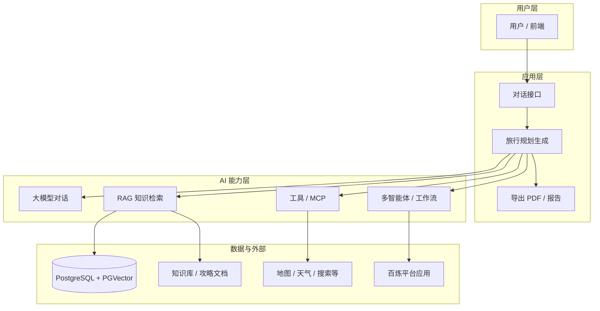
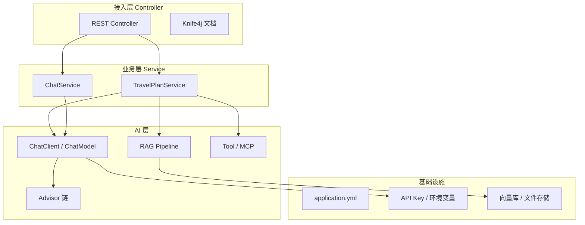

# AI 旅行规划助手 · 学习笔记（大纲篇）

> 课程原型：**AI 恋爱大师** → 本项目适配：**AI 旅行规划助手**  
> 下一章：[第 02 章 · AI 大模型接入](./学习笔记-02-AI大模型接入.md)  
> 深度思考：[深度思考练习手册](./深度思考练习手册.md)  
> 项目仓库：`ai-travel-planner`（`com.yupi:yu-ai-agent`）  
> 对应课程大纲：项目介绍 → 项目优势 → 功能梳理 → 技术选型 → 架构设计 → 准备工作 → 学习大纲

**友情提示**：AI 技术迭代快，教程细节可能过时；重点学 **思路和方法**，养成查 [Spring AI 官方文档](https://docs.spring.io/spring-ai/reference/) 的习惯。

**章节索引**

| 章节 | 文件 |
|------|------|
| 第 01 章 · 项目总览大纲 | [学习笔记-大纲篇](./学习笔记-大纲篇.md)（本文） |
| 第 02 章 · AI 大模型接入 | [学习笔记-02-AI大模型接入](./学习笔记-02-AI大模型接入.md) |
| 第 02 章 · 作业答案 | [学习笔记-02-作业答案](./学习笔记-02-作业答案.md) |
| 第 03 天 · Prompt 与多轮对话 | [学习笔记-03-Prompt与多轮对话](./学习笔记-03-Prompt与多轮对话.md) |
| 第 04 章 · RAG 知识库基础 | [学习笔记-04-RAG知识库基础](./学习笔记-04-RAG知识库基础.md) |
| 第 05 章 · RAG 进阶与调优 | [学习笔记-05-RAG进阶与调优](./学习笔记-05-RAG进阶与调优.md) |
| System Prompt 定稿 | [旅行规划-SystemPrompt](./旅行规划-SystemPrompt.md) |
| 深度思考练习（5 Whys / 费曼 / 规律） | [深度思考练习手册](./深度思考练习手册.md) |

---

## 一、项目介绍

### 1.1 项目是什么

**AI 旅行规划助手**（课程体系中亦称「AI 超级智能体」系列项目之一）是一个基于 **大模型 + Java 后端** 构建的智能应用：用户用自然语言描述旅行需求，系统通过 AI 理解意图、检索知识、调用工具，生成可执行的旅行方案（行程、预算、攻略等），并可导出为文档。

### 1.2 项目定位

| 维度 | 说明 |
|------|------|
| 业务场景 | 旅行规划（可扩展到其他垂直智能体） |
| 技术形态 | Spring Boot 单体后端 + 多种 AI 调用方式 |
| 学习定位 | 从「会调 API」到「会做完整 AI 应用」的实战项目 |
| 课程来源 | 编程导航 [codefather.cn](https://codefather.cn) · 鱼皮原创系列 |

### 1.3 为什么要做这个项目

- **AI 应用**是当前求职与业务落地的热点，仅会 ChatGPT 不够，需要会 **工程化集成**。
- 旅行规划场景 **需求清晰、交互自然**，适合练习：对话、RAG、工具调用、工作流、报告生成。
- 项目覆盖 **国内主流方案**（阿里云百炼 / DashScope）和 **开源方案**（Ollama、Spring AI、LangChain4j）。

### 1.4 当前仓库状态（本地起点）

```
ai-travel-planner/
├── AiTravelPlannerApplication.java    # 启动类
├── HealthController.java              # 健康检查 /api/health
├── demo/invoke/                       # 多种 AI 调用 Demo
│   ├── SdkAiInvoke.java               # DashScope 官方 SDK
│   ├── HttpAiInvoke.java              # HTTP 直连
│   ├── SpringAiAiInvoke.java          # Spring AI（百炼）
│   ├── OllamaAiInvoke.java            # Spring AI（本地 Ollama）
│   └── LangChainAiInvoke.java         # LangChain4j
└── demo/rag/                          # RAG 相关 Demo（进行中）
```

服务默认：`http://localhost:8123/api`  
API 文档：`http://localhost:8123/api/doc.html`（Knife4j）

---

## 二、项目优势

### 2.1 项目收获（学完后你能做什么）

**能力层面**

1. **多种方式调用大模型**：SDK、HTTP、Spring AI、LangChain4j、Ollama 本地模型。
2. **理解 AI 应用核心模块**：Prompt、对话记忆、RAG 检索增强、工具/MCP、结构化输出。
3. **会使用云平台**：百炼控制台创建智能体 / 工作流 / 编排（群组），并 API 集成。
4. **能设计 AI 应用架构**：分层、可扩展、可切换模型提供商。
5. **具备完整项目经验**：接口设计、文档、部署、排错（欠费、依赖冲突、数据源等）。

**简历 / 面试可写**

- 基于 Spring AI 的 AI 旅行规划系统
- 集成 DashScope + Ollama 双模型源
- RAG + MCP 工具调用 + PDF 报告导出（课程后续章节）

**个人笔记区（学习过程中填写）**

- [ ] 跑通 5 种 invoke Demo
- [ ] 百炼控制台三类应用已发布
- [ ] Spring Boot 本地启动成功
- [ ] 完成第一个业务接口

### 2.2 鱼皮系列项目优势

| 特点 | 对你的价值 |
|------|------------|
| **原创完整** | 从 0 到 1，不是碎片化 Demo |
| **保姆级教程** | 适合自学，步骤可跟做 |
| **贴近企业** | Spring Boot 3 + 主流 AI 框架，技术栈新 |
| **系列递进** | 可与鱼皮其他项目（用户中心、聚合搜索等）组成作品集 |
| **社区资源** | 编程导航有答疑、笔记、简历写法 |

**学习建议**：先跟视频走通主线，再回头看源码；每章做 **问题清单**（欠费、依赖冲突、数据源等，都是真实工程问题）。

---

## 三、项目功能梳理

### 3.1 功能全景



### 3.2 核心功能模块说明

| 模块 | 功能 | 典型技术 |
|------|------|----------|
| **智能对话** | 多轮问答、理解旅行意图 | ChatModel、ChatClient、记忆 |
| **行程规划** | 按天生成路线、景点、预算 | Prompt 工程、结构化输出 |
| **知识增强 RAG** | 基于攻略/景点文档回答更准确 | 向量库、Embedding、检索 |
| **工具调用** | 查天气、搜攻略、算预算 | Function Calling、MCP |
| **报告导出** | 生成 PDF 行程单 | iTextPDF |
| **平台应用集成** | 调用百炼上编排好的智能体 | DashScope Agent API |
| **API 与文档** | 对外 REST + 在线调试 | Spring MVC、Knife4j |

### 3.3 当前仓库已实现 / 待实现

| 状态 | 内容 |
|------|------|
| ✅ 已有 | 健康检查、多种 AI 调用 Demo、基础配置 |
| 🔄 进行中 | RAG（`MultiQueryExpanderDemo` 查询扩展） |
| ⏳ 课程后续 | 完整旅行规划业务、PGVector、MCP 实战、PDF 导出、前端 |

---

## 四、技术选型

### 4.1 技术栈总览

| 类别 | 选型 | 版本（当前 pom） | 选型理由 |
|------|------|------------------|----------|
| 语言 | Java | 21 | LTS，生态成熟 |
| 框架 | Spring Boot | 3.4.4 | 企业主流，与 Spring AI 深度集成 |
| 国内大模型 | 阿里云百炼 / DashScope | SDK 2.19.1 | 国内访问稳定、文档全 |
| AI 抽象层 | Spring AI | 1.0.0 | 官方 AI 框架，统一 Chat/Embedding/RAG |
| 阿里 AI 集成 | Spring AI Alibaba | 1.0.0.2 | 百炼开箱即用 |
| 备选框架 | LangChain4j | 1.0.0-beta2 | 对比学习、社区活跃 |
| 本地模型 | Ollama | — | 免费离线调试 |
| 工具协议 | MCP Client | Spring AI 1.0.0 | 标准化外部工具接入 |
| Web | Spring Web | — | REST API |
| 接口文档 | Knife4j + SpringDoc | 4.4.0 / 2.3.0 | 中文友好 |
| 工具库 | Hutool | 5.8.37 | HTTP、JSON 等便捷工具 |
| 文档解析 | jsoup、Markdown Reader | — | 网页/文档入库 |
| PDF | iText | 9.1.0 | 行程报告导出 |
| 序列化 | Kryo | 5.6.2 | 会话记忆持久化（课程用） |
| 结构化输出 | jsonschema-generator | 4.38.0 | 约束模型 JSON 输出 |
| 向量库（后续） | PostgreSQL + PGVector | — | RAG 存储（当前已暂时移除） |

### 4.2 为什么选多种调用方式？

课程故意提供 **5 种 invoke**，目的是对比而非全部用于生产：

| 方式 | 类 | 适用场景 |
|------|-----|----------|
| 官方 SDK | `SdkAiInvoke` | 最接近平台能力，功能全 |
| HTTP | `HttpAiInvoke` | 理解底层协议，任何语言都能学 |
| Spring AI | `SpringAiAiInvoke` | **项目主线**，与 Spring 生态一致 |
| Ollama | `OllamaAiInvoke` | 无网/省钱/本地实验 |
| LangChain4j | `LangChainAiInvoke` | 多框架对比、部分企业用法 |

**生产建议**：以 **Spring AI + DashScope** 为主，Ollama 作开发备用。

### 4.3 依赖管理要点（踩坑笔记）

1. **Spring AI 版本统一**：只用 BOM `1.0.0`，勿混用 `1.0.0-M6` 等里程碑包。
2. **百炼账号**：API Key + 余额；欠费错误码 `Arrearage`。
3. **PGVector**：未配数据库时不要引入 `spring-boot-starter-jdbc`。
4. **SLF4J**：`dashscope-sdk-java` 排除 `slf4j-simple`，避免多绑定警告。

---

## 五、架构设计

### 5.1 分层架构



### 5.2 核心设计思想

1. **面向接口编程**：业务依赖 `ChatModel` / `ChatClient`，不绑死某一厂商。
2. **Advisor 链**：在模型调用前后插入 RAG、记忆、日志等（Spring AI 特色）。
3. **配置外置**：`spring.ai.dashscope.api-key: ${DASHSCOPE_API_KEY}`，密钥不进仓库。
4. **Demo 与业务分离**：`demo.invoke` 用于学习，`controller/service` 用于正式功能。

### 5.3 数据流（一次旅行规划请求）

```text
用户输入
  → Controller 接收 DTO
  → Service 组装 Prompt（+ 历史记忆 + RAG 上下文）
  → ChatClient 调用大模型（必要时触发 Tool/MCP）
  → 结构化解析行程 JSON
  → 可选：写入会话 / 生成 PDF
  → 返回前端
```

### 5.4 与百炼平台应用的关系

| 层级 | 位置 | 作用 |
|------|------|------|
| 低代码 | 百炼控制台 | 快速验证 Prompt、工作流、智能体群组 |
| 代码集成 | Spring Boot | 可控、可定制、可上线 |

两者关系：**平台做原型与编排实验，代码做产品化**。

---

## 六、准备工作

### 6.1 AI 基础知识（最小必会清单）

**概念**

| 概念 | 一句话 |
|------|--------|
| 大模型 LLM | 根据上下文生成文本的神经网络 |
| Prompt | 给模型的指令与上下文 |
| Token | 计费与长度单位 |
| Temperature | 创造性 vs 稳定性 |
| System / User / Assistant | 对话角色 |

**应用模式**

| 模式 | 说明 |
|------|------|
| 纯对话 | 直接问答 |
| RAG | 先检索文档再回答，减少胡编 |
| Tool / Function Calling | 模型决定何时调外部 API |
| Agent | 多步推理 + 多次工具调用 |
| 工作流 | 固定步骤编排多个节点 |

**个人自测**

- [ ] 能解释 RAG 解决什么问题
- [ ] 知道 API Key 不能提交 Git
- [ ] 能区分「模型 API」和「百炼应用 API」

### 6.2 新建代码仓库（环境与工程）

**开发环境**

| 工具 | 要求 |
|------|------|
| JDK | 21 |
| IDEA | 推荐 IntelliJ IDEA |
| Maven | 3.8+，需能拉 Spring 仓库 |
| Git | 版本管理 |

**工程初始化检查清单**

```text
□ clone / 打开 ai-travel-planner
□ IDEA Reload Maven
□ 配置环境变量 DASHSCOPE_API_KEY
□ 运行 AiTravelPlannerApplication
□ 访问 http://localhost:8123/api/health → ok
□ 单独运行 SdkAiInvoke 验证模型调用
```

**配置要点（application.yml）**

- 端口：`8123`
- 上下文：`/api`
- 百炼 Key：`spring.ai.dashscope.api-key`
- Ollama：`http://localhost:11434`（可选）

### 6.3 AI 学习资源

**官方文档**

| 资源 | 链接 |
|------|------|
| 阿里云百炼 | https://bailian.console.aliyun.com/ |
| DashScope 模型列表 | https://help.aliyun.com/zh/model-studio/getting-started/models |
| Spring AI 文档 | https://docs.spring.io/spring-ai/reference/ |
| Spring AI Alibaba | https://github.com/alibaba/spring-ai-alibaba |
| Ollama | https://ollama.com/ |

**课程配套**

- 编程导航教程视频与文字稿
- 鱼皮 GitHub / 课程仓库（与本地对照）

**建议学习顺序**

```text
百炼控制台玩智能体 → 跑通 SDK Demo → 跑通 Spring AI → RAG → MCP → 业务接口 → PDF
```

### 6.4 百炼平台准备（必做）

按课程要求完成：

1. **智能体应用**（已发布）
2. **工作流应用**（已发布）
3. **智能体编排** → 新版用 **工作流 + 智能体群组** 代替

并确保：**账号已充值、无 Arrearage 欠费**。

---

## 七、学习大纲（章节路线图）

### 7.1 推荐学习路径

| 阶段 | 章节主题 | 学习目标 | 对应代码/动作 |
|------|----------|----------|----------------|
| **1** | 环境与 AI 认知 | 懂概念、配好环境 | 百炼三类应用、充值 |
| **2** | 大模型调用 | 会调通模型 | `SdkAiInvoke`、`HttpAiInvoke` |
| **3** | Spring AI 集成 | 掌握项目主线 | `SpringAiAiInvoke`、启动项目 |
| **4** | 本地模型 | 低成本调试 | `OllamaAiInvoke`、安装 Ollama |
| **5** | 多框架对比 | 拓宽视野 | `LangChainAiInvoke` |
| **6** | Prompt 与 ChatClient | 写好提示词、链式调用 | ChatClient、Advisor |
| **7** | RAG 检索增强 | 知识库问答 | `MultiQueryExpanderDemo`、PGVector |
| **8** | 工具与 MCP | 扩展能力 | `spring-ai-starter-mcp-client` |
| **9** | 记忆与结构化输出 | 多轮对话、JSON 行程 | Kryo、jsonschema |
| **10** | 业务开发 | 旅行规划 API | Controller / Service |
| **11** | 报告与爬虫 | PDF、攻略抓取 | iText、jsoup |
| **12** | 部署与优化 | 上线、排错 | 日志、监控、费用控制 |

### 7.2 每周学习计划（可参考）

| 周次 | 内容 | 产出 |
|------|------|------|
| 第 1 周 | 大纲 + 准备 + 5 种调用 | 笔记 + Demo 全跑通 |
| 第 2 周 | Spring AI + 对话接口 | `/api/chat` 可用 |
| 第 3 周 | RAG + 向量库 | 能基于文档问答 |
| 第 4 周 | MCP + 业务整合 | 完整规划流程 |
| 第 5 周 | PDF + 优化 + 简历 | 可演示的项目 |

### 7.3 学习笔记模板（每章复用 · 04 风格）

```markdown
# 学习笔记 · 第 X 章：XXX

> 课程原型：**AI 恋爱大师** → 本项目适配：**AI 旅行规划助手**  
> 前置章节：[第 X-1 章 · XXX](./学习笔记-X-XXX.md)  
> 下一章：[第 X+1 章 · XXX](./学习笔记-X+1-XXX.md)  
> 深度思考：[深度思考练习手册](./深度思考练习手册.md)  
> 项目仓库：`ai-travel-planner`（`com.yupi:yu-ai-agent`）

---

## 本章目标

1. ...

## 课程 → 本项目映射

| 课程（恋爱大师） | 你的项目（旅行规划） |
|------------------|----------------------|
| 恋爱知识库文档     | 杭州/云南等 **旅行攻略 .md** |
| ...              | ...                  |

---

## 一、第一节标题

> 本节回答：**为什么要做 X？业务上需要什么？**

### 1.1 ...

### 1.2 ...

---

## 二、第二节标题

...（重复 1.x 模式）

---

## 八、本章作业

- [ ] 概念题
- [ ] 实操题
- [ ] 跑通验证

---

## 九、踩坑预警

| 现象 | 原因 | 解决 |
|------|------|------|
| ... | ... | ... |

---

## 十、本章小结

| 要点 | 一句话 |
|------|--------|
| ... | ... |

---

## 附录：代码文件速查 → 详见 [学习笔记-04-RAG知识库基础.md 附录](./学习笔记-04-RAG知识库基础.md)

---

*最后更新：YYYY-MM-DD · 完整踩坑见 [深度思考练习手册](./深度思考练习手册.md)*
```

---

## 附录 A：常见问题速查

| 问题 | 原因 | 解决 |
|------|------|------|
| `Arrearage` | 百炼欠费 | 阿里云充值 |
| `ChatClientInputContentObservationFilter` 找不到 | Spring AI 版本混用 | 删除 M6 依赖，统一 1.0.0 |
| `Failed to determine a suitable driver class` | JDBC 无数据源配置 | 暂删 PG 依赖或配置 PostgreSQL |
| `Port 8123 already in use` | 上次进程未关 | 结束旧进程或改端口 |
| SLF4J multiple providers | dashscope 带了 slf4j-simple | pom 排除 |

---

## 附录 B：百炼平台创建应用（保姆级摘要）

### 智能体应用

1. 百炼控制台 → 应用管理 → 创建应用 → 智能体应用（Agent 2.0）
2. 选模型（如 `qwen-plus`），填写系统提示词
3. 右侧试运行 → 发布

### 工作流应用

1. 创建应用 → 工作流应用
2. 画布：`开始 → 大模型 → 结束`，连线并配置提示词
3. 试运行 → 发布

### 智能体编排（新版）

1. 先发布至少 1 个子智能体
2. 新建工作流，添加 **智能体群组** 节点，挂载子智能体
3. `开始 → 智能体群组 → 结束` → 试运行 → 发布

---

*最后更新：2026-06-03*
